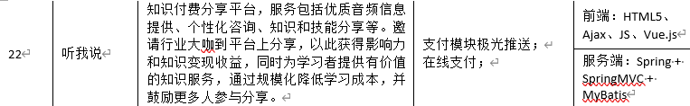
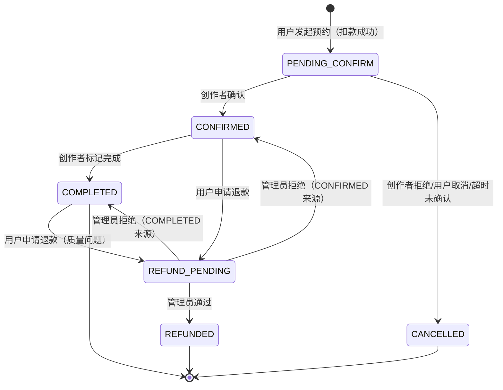

**必看**，目前很不完善，如果有特殊情况或其他问题，**务必**进行讨论，讨论后结果会进行更新。

## 背景



## 说明

- 需求表：[项目需求表](https://docs.qq.com/sheet/DRWdFVVZyTmp5bmpi?tab=b5ncyf&_t=1774419424611&nlc=1&u=dc8b8c6e7d0c4e4c8ed8695976f6e963)
- 接口文档：
	- [实体类文档](实体类文档.md)
	- [接口概要文档](接口概要文档.md)
	- [接口详情文档](接口详情文档.md)
- 代码规范：[代码规范](代码规范.md)
- 数据库设计：见 [schema.sql](https://github.com/AK47are/listen-to-me/blob/main/src/main/resources/schema.sql)

## 核心业务

本项目为「音频引流 + 1对1咨询变现」的专业知识服务平台

- 用户听音频，吸引付费，遇到疑惑向创作者进行一对一咨询
- 创作者通过音频吸引用户进行预约

> 参考：bilibili 人通过视频引流 + 通过直播连麦赚钱；我们这个更专业，小众。
> 类比B站模式，但差异点在于：
>
> - B站：视频引流 → 直播连麦（泛娱乐/轻互动）
> - 听我说：**音频**引流 → **预约制1对1咨询**（专业、深度、高客单价）

## 可能问题

1. 用户购买后，创作者跑路怎么办？
	- 平台提供了黑名单机制，来降低创作者跑路的风险
	- 平台拥有创作者真实信息，且创作者需要被审核
2. 用户和创作者绕开平台进行咨询怎么办？
	- 通过服务。当且仅当用户付费后才能查看咨询方式，创作者才能知道有用户向他预约，创作者可以选择是否处理等等。如果创作者不想接受这个服务，那就要回到最原始的聊天预约；如果用户不想接受这个服务，那就要承担被拉黑跑路的风险，平台没有办法证明
	- 通过防退款机制：创作者新到账金额必须等一段时间才能提现；用户需要退款需要被审核
3. 为何项目采用临时 URL，直接用公开 URL 访问头像、封面等等信息似乎没什么区别，而且实现更容易？
	- 文件存储 URL 并不会对访问人进行鉴权，使用临时 URL 可以保证资源请求每隔一段时间就需要向后端进行鉴权。就像 Token，每隔一段时间就需要重新获取
	- 如果不使用临时 URL，那么随便一个付费用户就可以将资源链接挂在网上，给所有人使用；又因为我们只使用了一个 Minio Bucket（只能给桶设置私密/公开读权限），所以其它非私密资源也一块使用了临时 URL

## 常见实现细节

1. 获取当前 userId：现在可以直接使用封装好的 `SecurityUtils` 获得
2. 存储 URL：上传文件时用 Redis 将临时 URL 和 objectName 绑定；后面要存 URL 时在 Redis 里查找
3. 分页查询 Query 类作为参数时需要添加 `@ParameterObject` 才能被 OpenAPI 文档正确解析
4. 校验用户权限：
	1. 在对应路由上面添加：Spring Security 权限注解
	2. 如果需要自定义信息：需要在 `SecurityConfig` 的 `AccessDeniedHandler` 配置，如下：

```java
.accessDeniedHandler((req, res, ex) -> {
    String msg = "权限不足，拒绝访问";
    String uri = req.getRequestURI();
    
    // 根据路径区分
    if (uri.contains("/creator/")) {
        msg = "您还不是创作者，无法执行此操作";
    } else if (uri.contains("/admin/")) {
        msg = "需要管理员权限";
    } else if (uri.contains("/audio/upload")) {
        msg = "无权上传音频";
    }
    
    renderJson(res, HttpStatus.HTTP_FORBIDDEN, Result.fail(403, msg));
})
```

> 这是一个不太优雅的方法，但没有更好的办法了。

5. DTO 参数校验，如果流程图让你校验数据，除了通过 if-else，也可以在 DTO 对象上使用 Spring 提供的注解来判断，这样更简单。
6. 更新数据库表和数据：因为表经常被修改调整，因此这里给出一段代码可以一键运行，主要要在 `schema.sql` 和 `data.sql` 所在文件夹下面访问 MySQL：

```sql
drop database `listen-to-me`;
create database `listen-to-me`;
use `listen-to-me`;
source schema.sql;
source data.sql;
```

7. 判断某个字段非 null 且非空：使用 hutool 包的 `StrUtil`，而不是 `xxx!=null && xxx.isBlank()`

## 订单状态图

订单状态很复杂，需要先看看下面状态图：

> 为了简化，这里不支持第三方支付，而是虚拟币直接扣除。



退款情况：

| 场景         | 订单状态          | 触发条件                       | 退款方式                               |
| ------------ | ----------------- | ------------------------------ | -------------------------------------- |
| 用户主动取消 | `PENDING_CONFIRM` | 用户点击取消                   | 全额自动退款                           |
| 创作者拒绝   | `PENDING_CONFIRM` | 创作者点击拒绝                 | 全额自动退款                           |
| 超时未确认   | `PENDING_CONFIRM` | 创作者48小时内未确认           | 全额自动退款                           |
| 超时未完成   | `CONFIRMED`       | 预约时间已过但创作者未标记完成 | 用户可申请退款，或系统自动发起退款申请 |
| 用户申请退款 | `CONFIRMED`       | 用户发起申请                   | 管理员审核                             |
| 咨询质量问题 | `COMPLETED`       | 特殊情况                       | 管理员审核                             |

也不用一直惦记，后面时序图会说明什么时候退款的，不过要能看懂代码。

## 其它想法

1. 支持消息推送；需要使用 Task