## 刷新令牌

POST `/common/auth/refresh` 刷新 Token

特别说明：请求已通过 JWT Filter 校验，Spring Security 上下文已包含 userId。返回时除新 Token 外，还返回用户最新信息，实现无感刷新

入参详情：无

出参详情：[LoginVO](实体类文档.md#LoginVO)

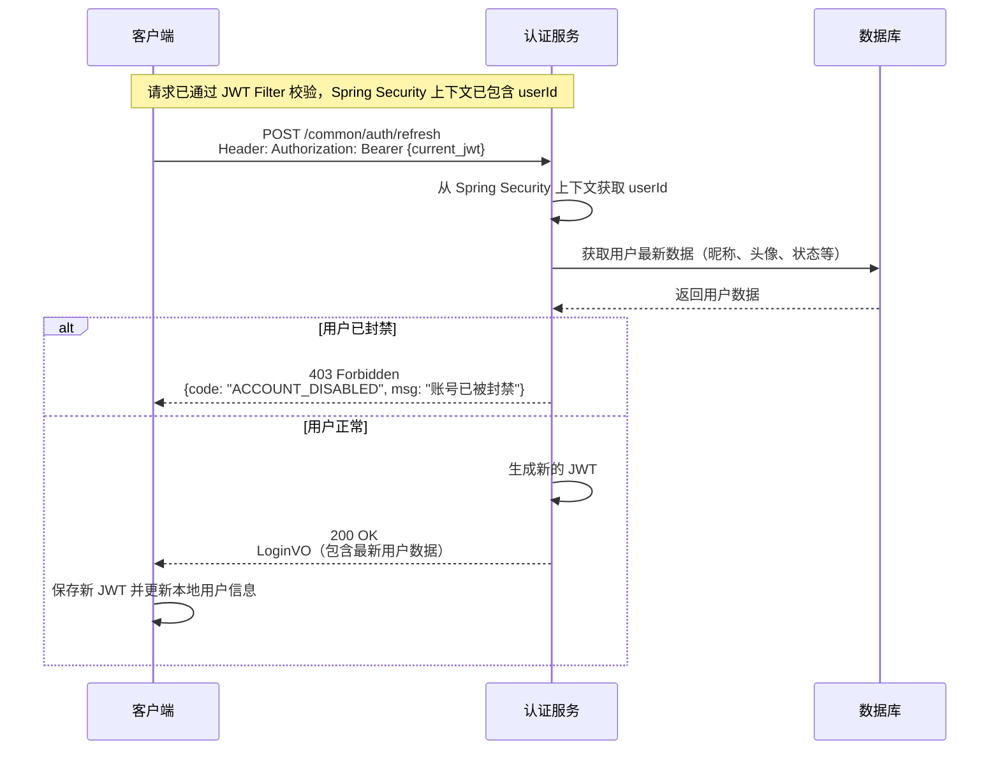
```mermaid
sequenceDiagram
    participant Client as 客户端
    participant Auth as 认证服务
    participant DB as 数据库

    Note over Client,Auth: 请求已通过 JWT Filter 校验，Spring Security 上下文已包含 userId

    Client->>Auth: POST /common/auth/refresh<br/>Header: Authorization: Bearer {current_jwt}
    Auth->>Auth: 从 Spring Security 上下文获取 userId
    Auth->>DB: 获取用户最新数据（昵称、头像、状态等）
    DB-->>Auth: 返回用户数据
    alt 用户已封禁
        Auth-->>Client: 403 Forbidden<br/>{code: "ACCOUNT_DISABLED", msg: "账号已被封禁"}
    else 用户正常
        Auth->>Auth: 生成新的 JWT
        Auth-->>Client: 200 OK<br/>LoginVO（包含最新用户数据）
        Client->>Client: 保存新 JWT 并更新本地用户信息
    end
```

## 账号注册

POST `/common/auth/register` 账号注册

特别说明：必须携带 username， email 或 phone 二选一

入参详情：[UserRegisterDTO](实体类文档.md#UserRegisterDTO)

出参详情：`Void`

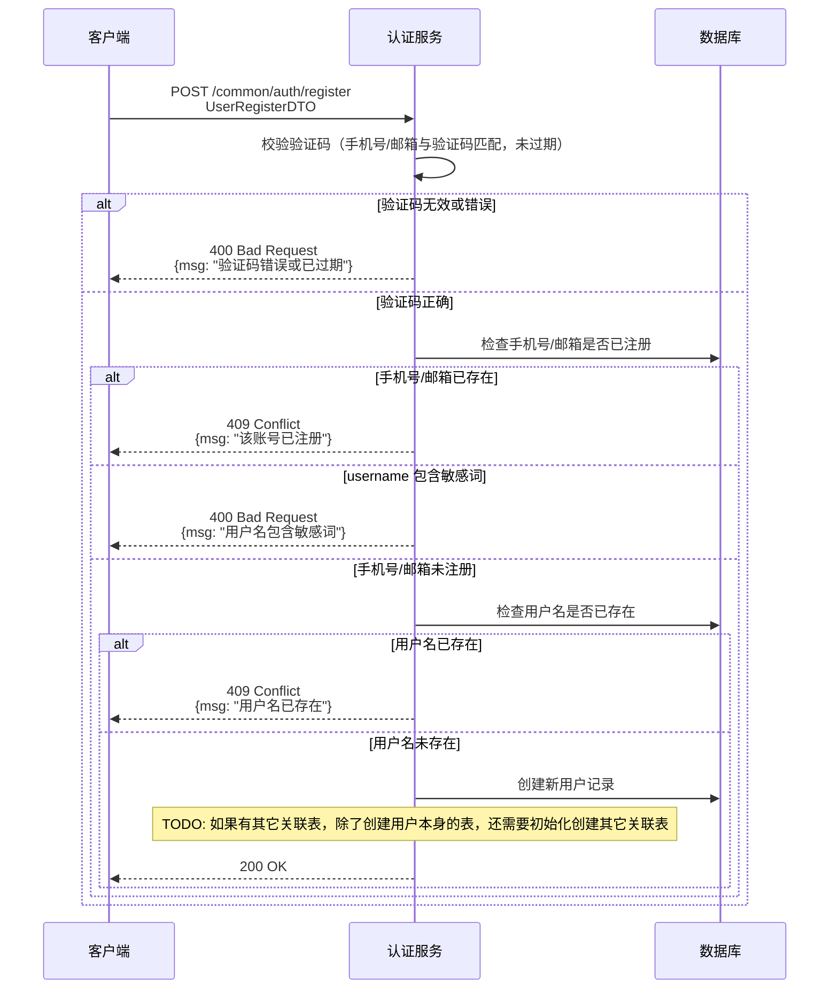
```mermaid
sequenceDiagram
    participant Client as 客户端
    participant Auth as 认证服务
    participant DB as 数据库

    Client->>Auth: POST /common/auth/register<br/>UserRegisterDTO
    Auth->>Auth: 校验验证码（手机号/邮箱与验证码匹配，未过期）
    alt 验证码无效或错误
        Auth-->>Client: 400 Bad Request<br/>{msg: "验证码错误或已过期"}
    else 验证码正确
        Auth->>DB: 检查手机号/邮箱是否已注册
        alt 手机号/邮箱已存在
            Auth-->>Client: 409 Conflict<br/>{msg: "该账号已注册"}
		 else username 包含敏感词
		     Auth-->>Client: 400 Bad Request<br/>{msg: "用户名包含敏感词"}
        else 手机号/邮箱未注册
            Auth->>DB: 检查用户名是否已存在
            alt 用户名已存在
                Auth-->>Client: 409 Conflict<br/>{msg: "用户名已存在"}
            else 用户名未存在
                Auth->>DB: 创建新用户记录
            Note over Auth: TODO: 如果有其它关联表，除了创建用户本身的表，还需要初始化创建其它关联表
                Auth-->>Client: 200 OK
            end
        end
    end
```

## 获取个人资料

GET `/user/profile` 获取个人资料

入参详情：无

出参详情：[UserVO](实体类文档.md#UserVO)

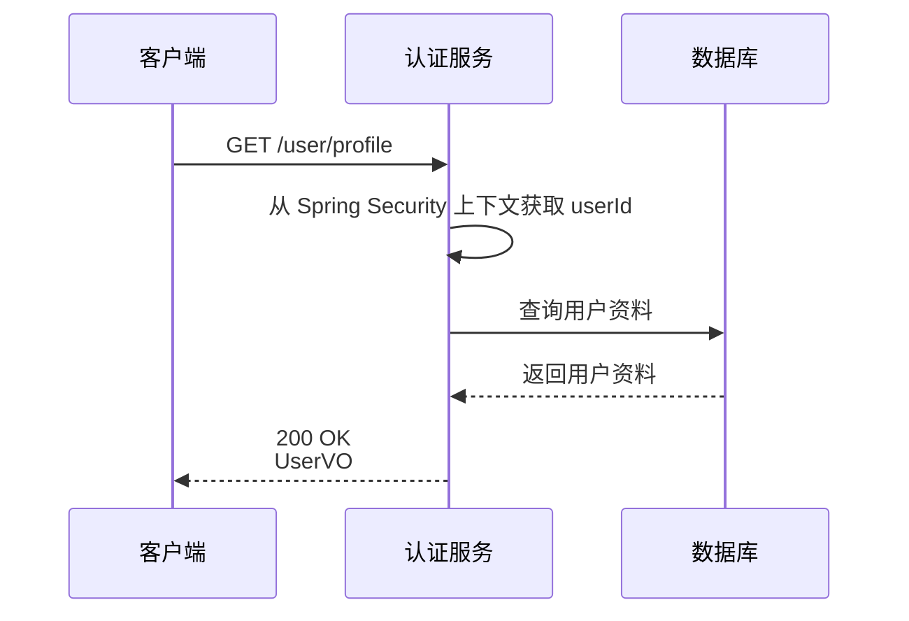
```mermaid
sequenceDiagram
    participant Client as 客户端
    participant Auth as 认证服务
    participant DB as 数据库

    Client->>Auth: GET /user/profile
    Auth->>Auth: 从 Spring Security 上下文获取 userId
    Auth->>DB: 查询用户资料
    DB-->>Auth: 返回用户资料
    Auth-->>Client: 200 OK<br/>UserVO
```

## 修改个人资料

PUT `/user/profile` 修改个人资料

入参详情：[UserProfileUpdateDTO](实体类文档.md#UserProfileUpdateDTO)

出参详情：`Void`

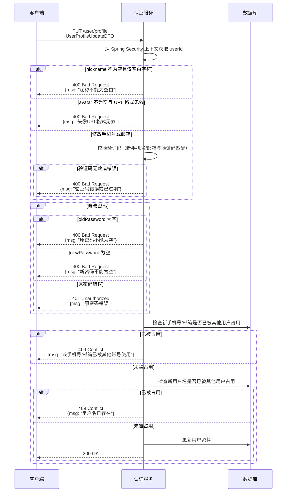
```mermaid
sequenceDiagram
    participant Client as 客户端
    participant Auth as 认证服务
    participant DB as 数据库

    Client->>Auth: PUT /user/profile<br/>UserProfileUpdateDTO
    Auth->>Auth: 从 Spring Security 上下文获取 userId

    alt nickname 不为空且仅空白字符
        Auth-->>Client: 400 Bad Request<br/>{msg: "昵称不能为空白"}
    else avatar 不为空且 URL 格式无效
        Auth-->>Client: 400 Bad Request<br/>{msg: "头像URL格式无效"}
    else 修改手机号或邮箱
        Auth->>Auth: 校验验证码（新手机号/邮箱与验证码匹配）
        alt 验证码无效或错误
            Auth-->>Client: 400 Bad Request<br/>{msg: "验证码错误或已过期"}
        end
    end

    alt 修改密码
        alt oldPassword 为空
            Auth-->>Client: 400 Bad Request<br/>{msg: "原密码不能为空"}
        else newPassword 为空
            Auth-->>Client: 400 Bad Request<br/>{msg: "新密码不能为空"}
        else 原密码错误
            Auth-->>Client: 401 Unauthorized<br/>{msg: "原密码错误"}
        end
    end

    Auth->>DB: 检查新手机号/邮箱是否已被其他用户占用
    alt 已被占用
        Auth-->>Client: 409 Conflict<br/>{msg: "该手机号/邮箱已被其他账号使用"}
    else 未被占用
        Auth->>DB: 检查新用户名是否已被其他用户占用
        alt 已被占用
            Auth-->>Client: 409 Conflict<br/>{msg: "用户名已存在"}
        else 未被占用
            Auth->>DB: 更新用户资料
            Auth-->>Client: 200 OK
        end
    end
```

## 获取播放签名

GET `/common/file/sign` 获取播放签名

特别说明：签名即临时 URL，同时负责 play_count 计算。为防止恶意刷量，同一用户对同一音频短时间内多次请求只计一次，用 Redis 记录，过期时间 1 小时

入参详情：`audioId`

出参详情：`String`（预签名URL）

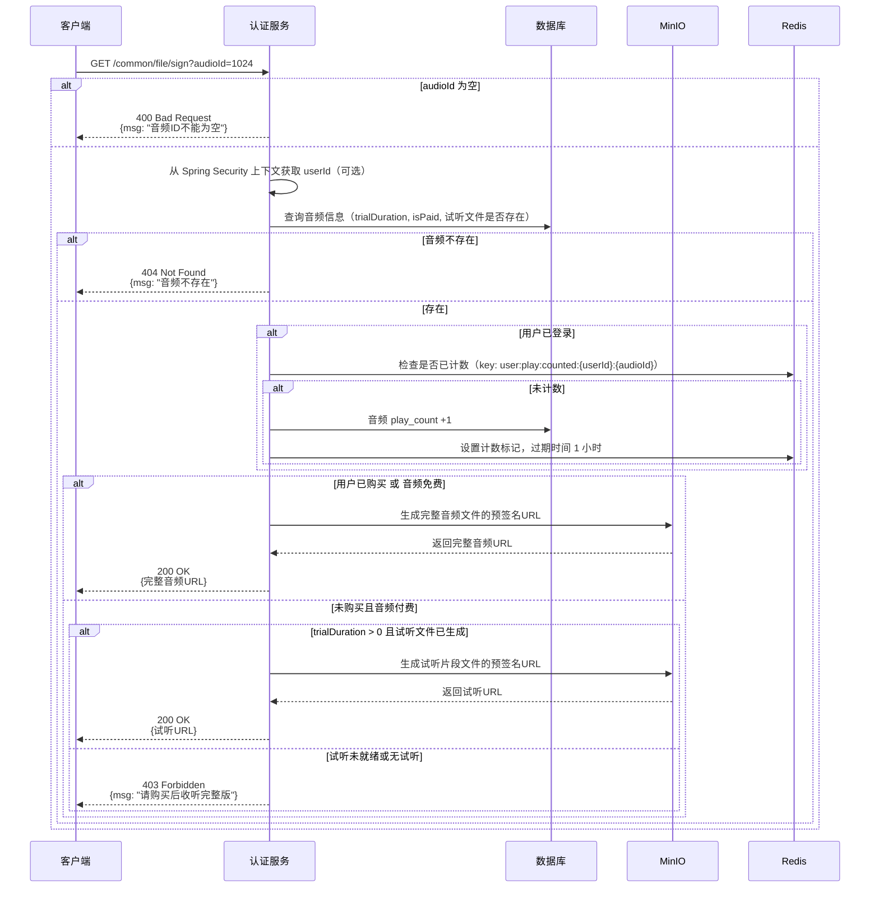
```mermaid
sequenceDiagram
    participant Client as 客户端
    participant Auth as 认证服务
    participant DB as 数据库
    participant Minio as MinIO
    participant Redis as Redis

    Client->>Auth: GET /common/file/sign?audioId=1024
    alt audioId 为空
        Auth-->>Client: 400 Bad Request<br/>{msg: "音频ID不能为空"}
    else
        Auth->>Auth: 从 Spring Security 上下文获取 userId（可选）
        Auth->>DB: 查询音频信息（trialDuration, isPaid, 试听文件是否存在）
        alt 音频不存在
            Auth-->>Client: 404 Not Found<br/>{msg: "音频不存在"}
        else 存在
            alt 用户已登录
                Auth->>Redis: 检查是否已计数（key: user:play:counted:{userId}:{audioId}）
                alt 未计数
                    Auth->>DB: 音频 play_count +1
                    Auth->>Redis: 设置计数标记，过期时间 1 小时
                end
            end

            alt 用户已购买 或 音频免费
                Auth->>Minio: 生成完整音频文件的预签名URL
                Minio-->>Auth: 返回完整音频URL
                Auth-->>Client: 200 OK<br/>{完整音频URL}
            else 未购买且音频付费
                alt trialDuration > 0 且试听文件已生成
                    Auth->>Minio: 生成试听片段文件的预签名URL
                    Minio-->>Auth: 返回试听URL
                    Auth-->>Client: 200 OK<br/>{试听URL}
                else 试听未就绪或无试听
                    Auth-->>Client: 403 Forbidden<br/>{msg: "请购买后收听完整版"}
                end
            end
        end
    end
```

## 获取音频详情

GET `/user/audio/{id}` 获取音频详情

入参详情：路径参数 `id`

出参详情：[AudioDetailVO](实体类文档.md#AudioDetailVO)

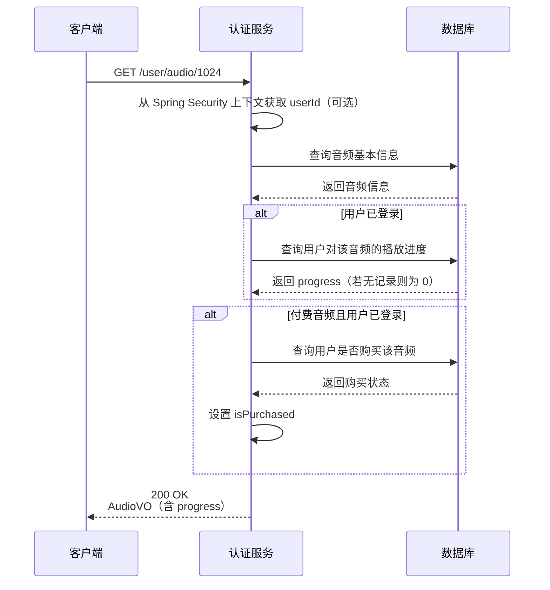
```mermaid
sequenceDiagram
    participant Client as 客户端
    participant Auth as 认证服务
    participant DB as 数据库

    Client->>Auth: GET /user/audio/1024
    Auth->>Auth: 从 Spring Security 上下文获取 userId（可选）
    Auth->>DB: 查询音频基本信息
    DB-->>Auth: 返回音频信息
    alt 用户已登录
        Auth->>DB: 查询用户对该音频的播放进度
        DB-->>Auth: 返回 progress（若无记录则为 0）
    end
    alt 付费音频且用户已登录
        Auth->>DB: 查询用户是否购买该音频
        DB-->>Auth: 返回购买状态
        Auth->>Auth: 设置 isPurchased
    end
    Auth-->>Client: 200 OK<br/>AudioVO（含 progress）
```

## 收藏或取消收藏

POST `/user/audio/action` 收藏或取消收藏

特别说明：
- 收藏时需要增加该收藏夹的音频计数
- 取消收藏时需要减少对应收藏夹的音频计数

入参详情：[FavoriteActionDTO](实体类文档.md#FavoriteActionDTO)

出参详情：`Void`

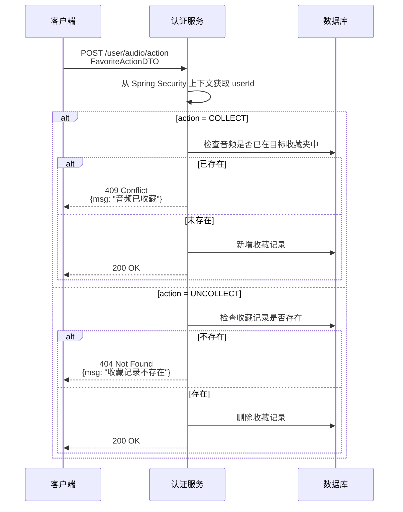
```mermaid
sequenceDiagram
    participant Client as 客户端
    participant Auth as 认证服务
    participant DB as 数据库

    Client->>Auth: POST /user/audio/action<br/>FavoriteActionDTO
    Auth->>Auth: 从 Spring Security 上下文获取 userId

    alt action = COLLECT
        Auth->>DB: 检查音频是否已在目标收藏夹中
        alt 已存在
            Auth-->>Client: 409 Conflict<br/>{msg: "音频已收藏"}
        else 未存在
            Auth->>DB: 新增收藏记录
            Auth-->>Client: 200 OK
        end
    else action = UNCOLLECT
        Auth->>DB: 检查收藏记录是否存在
        alt 不存在
            Auth-->>Client: 404 Not Found<br/>{msg: "收藏记录不存在"}
        else 存在
            Auth->>DB: 删除收藏记录
            Auth-->>Client: 200 OK
        end
    end
```

## 创建收藏夹

POST `/user/favorite/folder` 创建收藏夹

入参详情：[FolderDTO](实体类文档.md#FolderDTO)

出参详情：`Void`

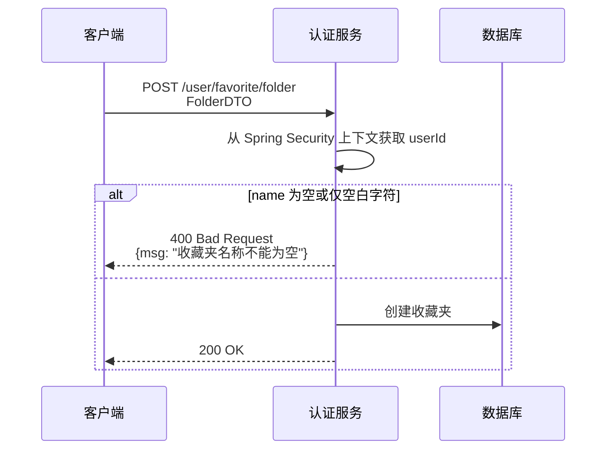
```mermaid
sequenceDiagram
    participant Client as 客户端
    participant Auth as 认证服务
    participant DB as 数据库

    Client->>Auth: POST /user/favorite/folder<br/>FolderDTO
    Auth->>Auth: 从 Spring Security 上下文获取 userId
    alt name 为空或仅空白字符
        Auth-->>Client: 400 Bad Request<br/>{msg: "收藏夹名称不能为空"}
    else
		Auth->>DB: 创建收藏夹
		Auth-->>Client: 200 OK
    end
```

## 获取收藏夹列表

GET `/user/favorite/folder/list` 获取收藏夹列表

入参详情：无

出参详情：[List\<FolderVO\>](实体类文档.md#FolderVO)

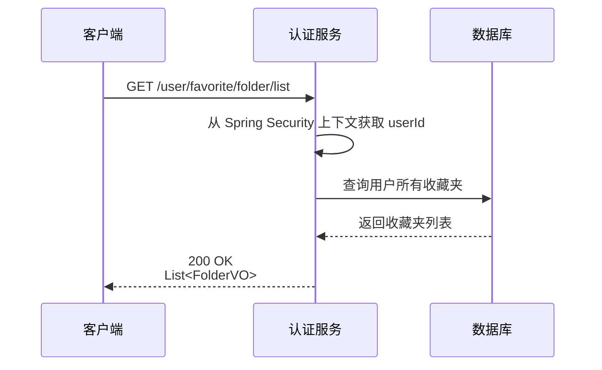
```mermaid
sequenceDiagram
    participant Client as 客户端
    participant Auth as 认证服务
    participant DB as 数据库

    Client->>Auth: GET /user/favorite/folder/list
    Auth->>Auth: 从 Spring Security 上下文获取 userId
    Auth->>DB: 查询用户所有收藏夹
    DB-->>Auth: 返回收藏夹列表
    Auth-->>Client: 200 OK<br/>List<FolderVO>
```

## 分页查询收藏音频

GET `/user/favorite/page` 分页查询收藏音频

入参详情：[FavoriteQuery](实体类文档.md#FavoriteQuery)

出参详情：[IPage\<AudioVO\>](实体类文档.md#AudioVO)

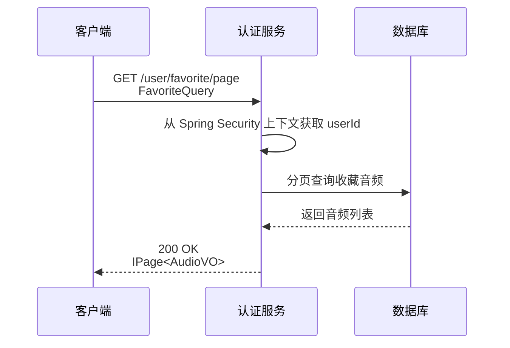
```mermaid
sequenceDiagram
    participant Client as 客户端
    participant Auth as 认证服务
    participant DB as 数据库

    Client->>Auth: GET /user/favorite/page<br/>FavoriteQuery
    Auth->>Auth: 从 Spring Security 上下文获取 userId
    Auth->>DB: 分页查询收藏音频
    DB-->>Auth: 返回音频列表
    Auth-->>Client: 200 OK<br/>IPage<AudioVO>
```

## 删除收藏夹

DELETE `/user/favorite/folder/{folderId}` 删除收藏夹

入参详情：路径参数 `folderId`

出参详情：`Void`

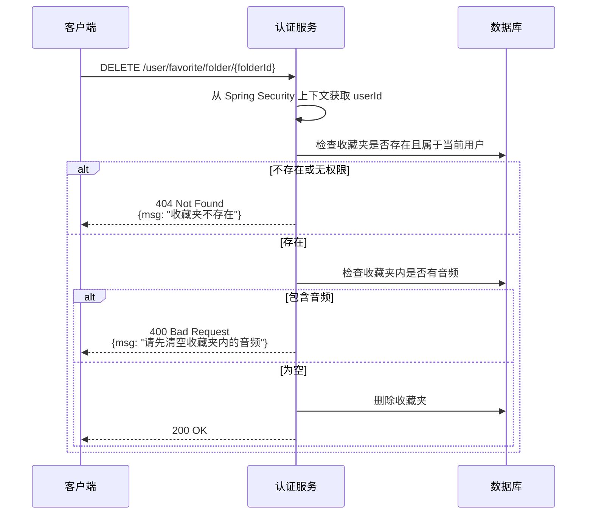
```mermaid
sequenceDiagram
    participant Client as 客户端
    participant Auth as 认证服务
    participant DB as 数据库

    Client->>Auth: DELETE /user/favorite/folder/{folderId}
    Auth->>Auth: 从 Spring Security 上下文获取 userId
    Auth->>DB: 检查收藏夹是否存在且属于当前用户
    alt 不存在或无权限
        Auth-->>Client: 404 Not Found<br/>{msg: "收藏夹不存在"}
    else 存在
        Auth->>DB: 检查收藏夹内是否有音频
        alt 包含音频
            Auth-->>Client: 400 Bad Request<br/>{msg: "请先清空收藏夹内的音频"}
        else 为空
            Auth->>DB: 删除收藏夹
            Auth-->>Client: 200 OK
        end
    end
```

## 喜欢或取消喜欢

POST `/user/audio/like` 喜欢或取消喜欢

入参详情：[LikeActionDTO](实体类文档.md#LikeActionDTO)

出参详情：`Void`

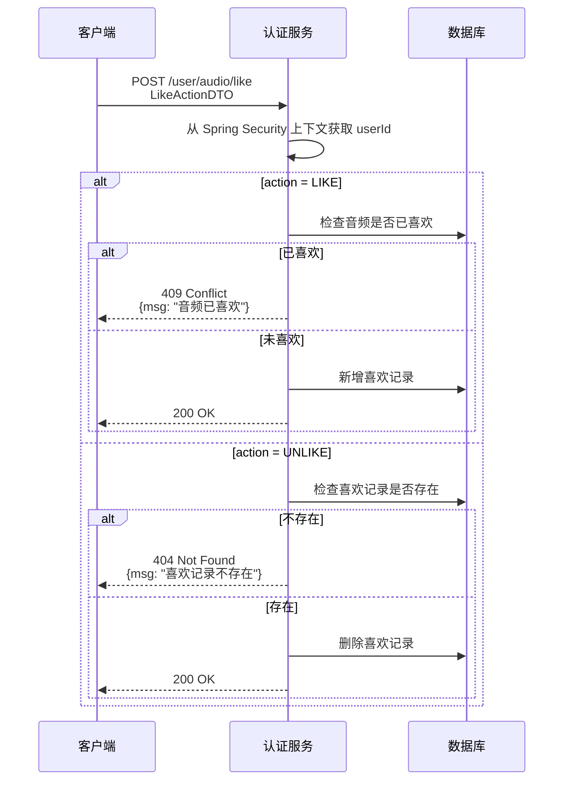
```mermaid
sequenceDiagram
    participant Client as 客户端
    participant Auth as 认证服务
    participant DB as 数据库

    Client->>Auth: POST /user/audio/like<br/>LikeActionDTO
    Auth->>Auth: 从 Spring Security 上下文获取 userId

    alt action = LIKE
        Auth->>DB: 检查音频是否已喜欢
        alt 已喜欢
            Auth-->>Client: 409 Conflict<br/>{msg: "音频已喜欢"}
        else 未喜欢
            Auth->>DB: 新增喜欢记录
            Auth-->>Client: 200 OK
        end
    else action = UNLIKE
        Auth->>DB: 检查喜欢记录是否存在
        alt 不存在
            Auth-->>Client: 404 Not Found<br/>{msg: "喜欢记录不存在"}
        else 存在
            Auth->>DB: 删除喜欢记录
            Auth-->>Client: 200 OK
        end
    end
```

## 分页查询喜欢音频

GET `/user/like/page` 分页查询喜欢音频

入参详情：[PageQuery](实体类文档.md#PageQuery)

出参详情：[IPage\<AudioVO\>](实体类文档.md#AudioVO)

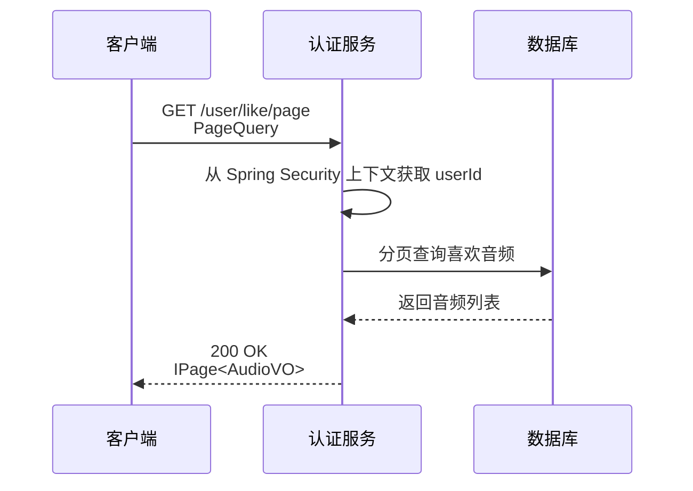
```mermaid
sequenceDiagram
    participant Client as 客户端
    participant Auth as 认证服务
    participant DB as 数据库

    Client->>Auth: GET /user/like/page<br/>PageQuery
    Auth->>Auth: 从 Spring Security 上下文获取 userId
    Auth->>DB: 分页查询喜欢音频
    DB-->>Auth: 返回音频列表
    Auth-->>Client: 200 OK<br/>IPage<AudioVO>
```

## 记录播放进度

POST `/user/history` 记录播放进度

特别说明：前端定期发送该请求。播放记录表需定期清理

入参详情：[HistoryProgressDTO](实体类文档.md#HistoryProgressDTO)

出参详情：`Void`

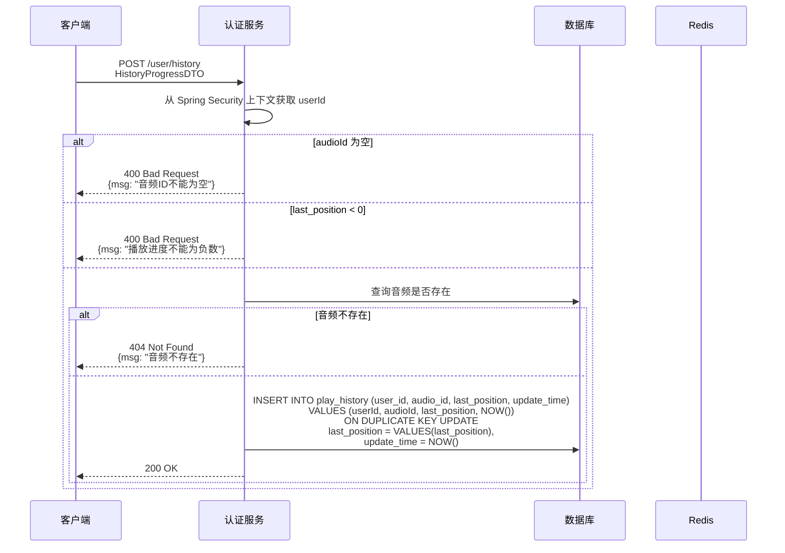
```mermaid
sequenceDiagram
    participant Client as 客户端
    participant Auth as 认证服务
    participant DB as 数据库
    participant Redis as Redis

    Client->>Auth: POST /user/history<br/>HistoryProgressDTO
    Auth->>Auth: 从 Spring Security 上下文获取 userId
    alt audioId 为空
        Auth-->>Client: 400 Bad Request<br/>{msg: "音频ID不能为空"}
    else last_position < 0
        Auth-->>Client: 400 Bad Request<br/>{msg: "播放进度不能为负数"}
    else
        Auth->>DB: 查询音频是否存在
        alt 音频不存在
            Auth-->>Client: 404 Not Found<br/>{msg: "音频不存在"}
        else
            Auth->>DB: INSERT INTO play_history (user_id, audio_id, last_position, update_time)<br/>VALUES (userId, audioId, last_position, NOW())<br/>ON DUPLICATE KEY UPDATE<br/>last_position = VALUES(last_position),<br/>update_time = NOW()
            Auth-->>Client: 200 OK
        end
    end
```

## 获取播放进度

GET `/user/history/{audioId}` 获取播放进度

入参详情：路径参数 `audioId`

出参详情：`Integer`

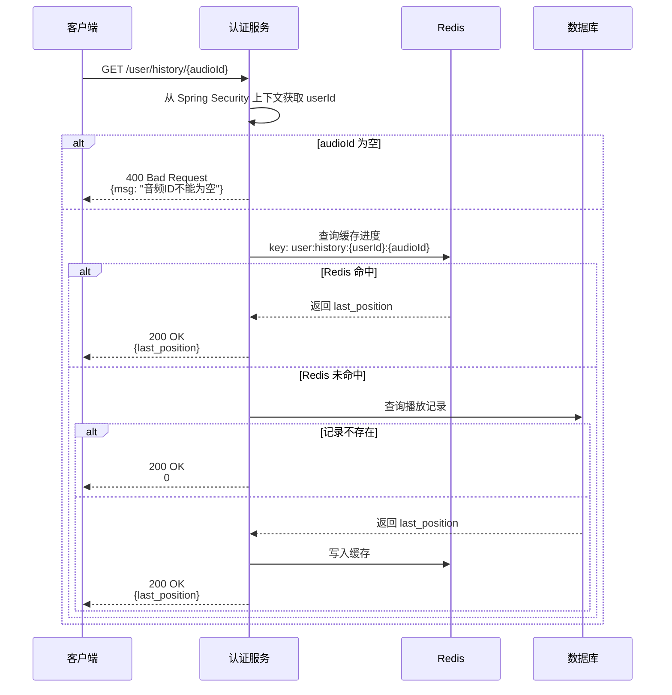
```mermaid
sequenceDiagram
    participant Client as 客户端
    participant Auth as 认证服务
    participant Redis as Redis
    participant DB as 数据库

    Client->>Auth: GET /user/history/{audioId}
    Auth->>Auth: 从 Spring Security 上下文获取 userId
    alt audioId 为空
        Auth-->>Client: 400 Bad Request<br/>{msg: "音频ID不能为空"}
    else
        Auth->>Redis: 查询缓存进度<br/>key: user:history:{userId}:{audioId}
        alt Redis 命中
            Redis-->>Auth: 返回 last_position
            Auth-->>Client: 200 OK<br/>{last_position}
        else Redis 未命中
            Auth->>DB: 查询播放记录
            alt 记录不存在
                Auth-->>Client: 200 OK<br/>0
            else
                DB-->>Auth: 返回 last_position
                Auth->>Redis: 写入缓存
                Auth-->>Client: 200 OK<br/>{last_position}
            end
        end
    end
```

> TODO: 在代码里添加说明，明明写多读少，却要写的时候必须走数据库，后续改成异步 Redis 方式，让数据库定时向 Redis 读取更新数据

## 分页查询历史记录

GET `/user/history/page` 分页查询历史记录

入参详情：[PageQuery](实体类文档.md#PageQuery)

出参详情：[IPage\<AudioVO\>](实体类文档.md#AudioVO)

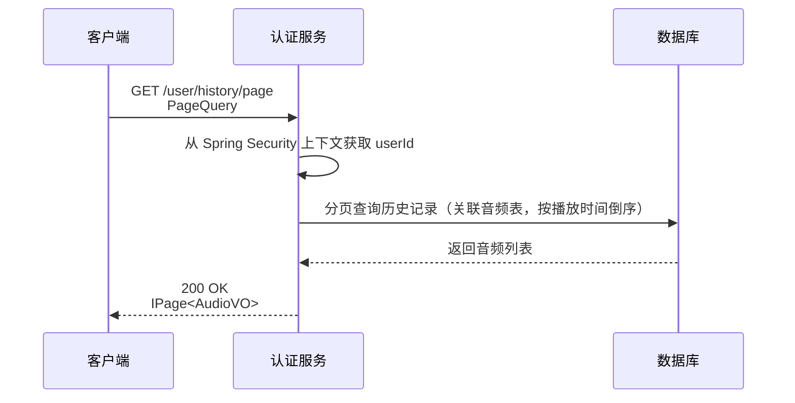
```mermaid
sequenceDiagram
    participant Client as 客户端
    participant Auth as 认证服务
    participant DB as 数据库

    Client->>Auth: GET /user/history/page<br/>PageQuery
    Auth->>Auth: 从 Spring Security 上下文获取 userId
    Auth->>DB: 分页查询历史记录（关联音频表，按播放时间倒序）
    DB-->>Auth: 返回音频列表
    Auth-->>Client: 200 OK<br/>IPage<AudioVO>
```

## 发表评论

POST `/user/comment` 发表评论

入参详情：[CommentDTO](实体类文档.md#CommentDTO)

出参详情：`Void`

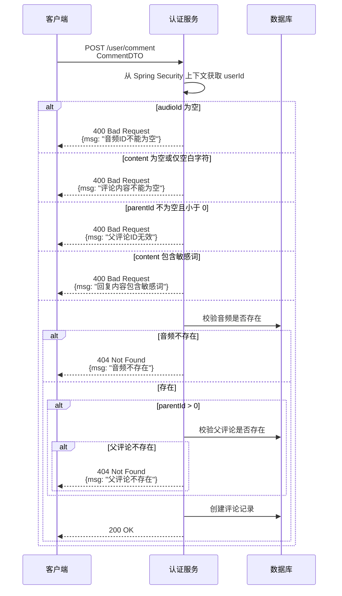
```mermaid
sequenceDiagram
    participant Client as 客户端
    participant Auth as 认证服务
    participant DB as 数据库

    Client->>Auth: POST /user/comment<br/>CommentDTO
    Auth->>Auth: 从 Spring Security 上下文获取 userId
    alt audioId 为空
        Auth-->>Client: 400 Bad Request<br/>{msg: "音频ID不能为空"}
    else content 为空或仅空白字符
        Auth-->>Client: 400 Bad Request<br/>{msg: "评论内容不能为空"}
    else parentId 不为空且小于 0
        Auth-->>Client: 400 Bad Request<br/>{msg: "父评论ID无效"}
    else content 包含敏感词
        Auth-->>Client: 400 Bad Request<br/>{msg: "回复内容包含敏感词"}
    else
        Auth->>DB: 校验音频是否存在
        alt 音频不存在
            Auth-->>Client: 404 Not Found<br/>{msg: "音频不存在"}
        else 存在
            alt parentId > 0
                Auth->>DB: 校验父评论是否存在
                alt 父评论不存在
                    Auth-->>Client: 404 Not Found<br/>{msg: "父评论不存在"}
                end
            end
            Auth->>DB: 创建评论记录
            Auth-->>Client: 200 OK
        end
    end
```

## 评论列表

GET `/user/comment/page` 评论列表

入参详情：[CommentQuery](实体类文档.md#CommentQuery)

出参详情：[IPage\<CommentVO\>](实体类文档.md#CommentVO)

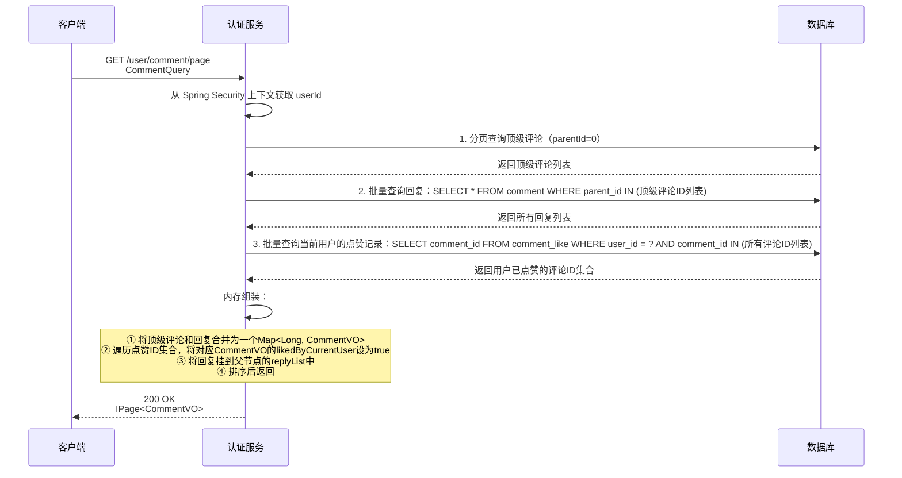
```mermaid
sequenceDiagram
    participant Client as 客户端
    participant Auth as 认证服务
    participant DB as 数据库

    Client->>Auth: GET /user/comment/page<br/>CommentQuery
    Auth->>Auth: 从 Spring Security 上下文获取 userId
    Auth->>DB: 1. 分页查询顶级评论（parentId=0）
    DB-->>Auth: 返回顶级评论列表
    Auth->>DB: 2. 批量查询回复：SELECT * FROM comment WHERE parent_id IN (顶级评论ID列表)
    DB-->>Auth: 返回所有回复列表
    Auth->>DB: 3. 批量查询当前用户的点赞记录：SELECT comment_id FROM comment_like WHERE user_id = ? AND comment_id IN (所有评论ID列表)
    DB-->>Auth: 返回用户已点赞的评论ID集合
    Auth->>Auth: 内存组装：
    Note over Auth: ① 将顶级评论和回复合并为一个Map<Long, CommentVO><br/>② 遍历点赞ID集合，将对应CommentVO的likedByCurrentUser设为true<br/>③ 将回复挂到父节点的replyList中<br/>④ 排序后返回
    Auth-->>Client: 200 OK<br/>IPage<CommentVO>
```

## 点赞或取消点赞评论

POST `/user/comment/like` 点赞或取消点赞评论

入参详情：[CommentLikeDTO](实体类文档.md#CommentLikeDTO)

出参详情：`Void`

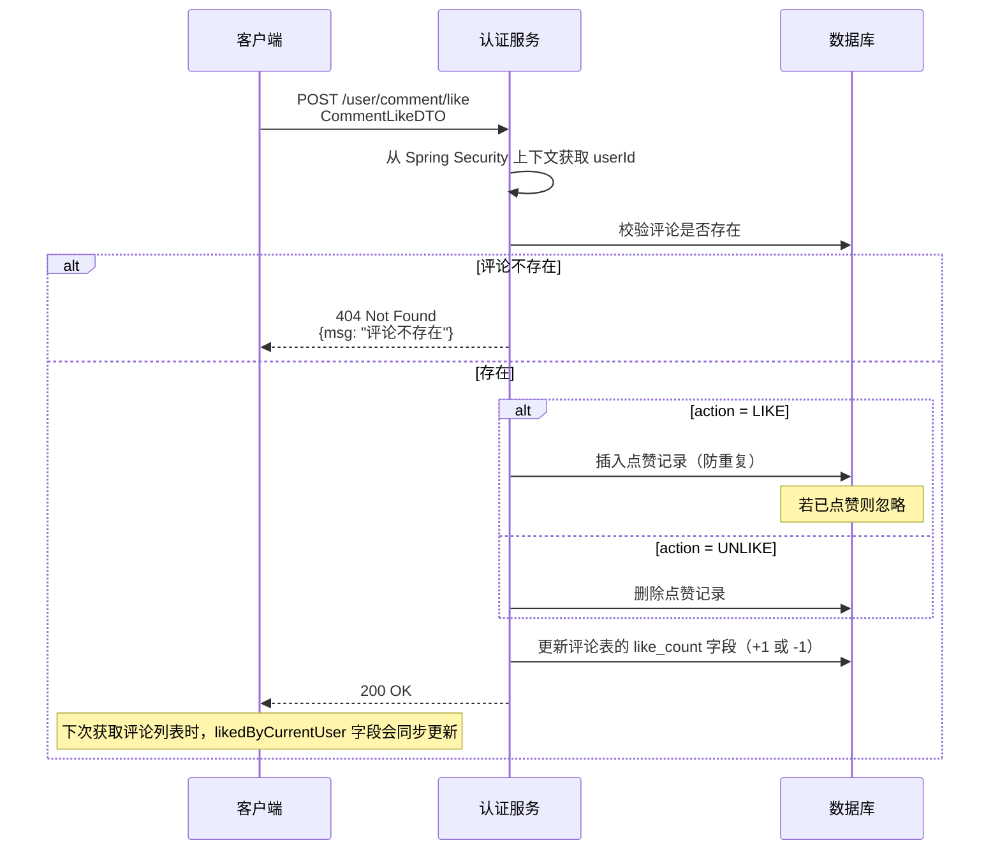
```mermaid
sequenceDiagram
    participant Client as 客户端
    participant Auth as 认证服务
    participant DB as 数据库

    Client->>Auth: POST /user/comment/like<br/>CommentLikeDTO
    Auth->>Auth: 从 Spring Security 上下文获取 userId
    Auth->>DB: 校验评论是否存在
    alt 评论不存在
        Auth-->>Client: 404 Not Found<br/>{msg: "评论不存在"}
    else 存在
        alt action = LIKE
            Auth->>DB: 插入点赞记录（防重复）
            Note over DB: 若已点赞则忽略
        else action = UNLIKE
            Auth->>DB: 删除点赞记录
        end
        Auth->>DB: 更新评论表的 like_count 字段（+1 或 -1）
        Auth-->>Client: 200 OK
        Note over Client: 下次获取评论列表时，likedByCurrentUser 字段会同步更新
    end
```

## 回复评论

POST `/user/comment/reply` 回复评论

入参详情：[CommentReplyDTO](实体类文档.md#CommentReplyDTO)

出参详情：`Void`

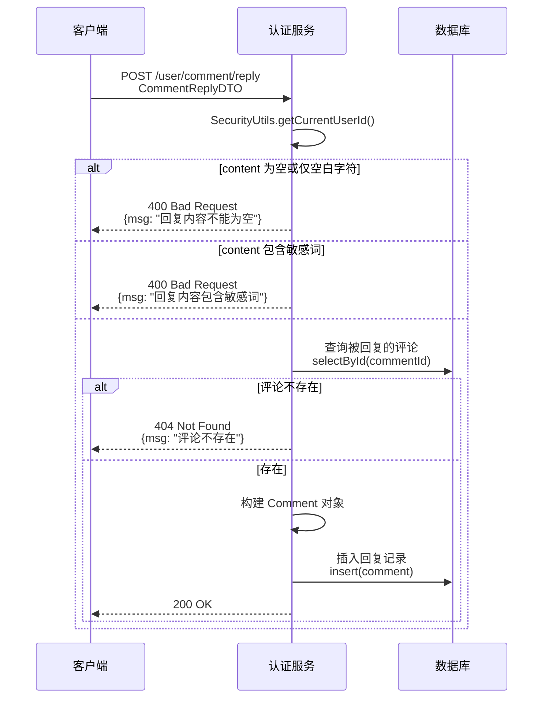
```mermaid
sequenceDiagram
    participant Client as 客户端
    participant Auth as 认证服务
    participant DB as 数据库

    Client->>Auth: POST /user/comment/reply<br/>CommentReplyDTO
    Auth->>Auth: SecurityUtils.getCurrentUserId()
    
    alt content 为空或仅空白字符
        Auth-->>Client: 400 Bad Request<br/>{msg: "回复内容不能为空"}
    else content 包含敏感词
        Auth-->>Client: 400 Bad Request<br/>{msg: "回复内容包含敏感词"}
    else
        Auth->>DB: 查询被回复的评论<br/>selectById(commentId)
        alt 评论不存在
            Auth-->>Client: 404 Not Found<br/>{msg: "评论不存在"}
        else 存在
            Auth->>Auth: 构建 Comment 对象
            Auth->>DB: 插入回复记录<br/>insert(comment)
            Auth-->>Client: 200 OK
        end
    end
```

## 搜索音频

GET `/user/audio/search` 搜索音频

入参详情：[AudioSearchQuery](实体类文档.md#AudioSearchQuery)

出参详情：[IPage\<AudioVO\>](实体类文档.md#AudioVO)

```mermaid
sequenceDiagram
    participant Client as 客户端
    participant Auth as 认证服务
    participant DB as 数据库

    Client->>Auth: GET /user/audio/search<br/>AudioSearchQuery
    alt keyword 为空或仅空白字符
        Auth-->>Client: 400 Bad Request<br/>{msg: "搜索关键词不能为空"}
    else searchType 为空
        Auth-->>Client: 400 Bad Request<br/>{msg: "搜索类型不能为空"}
    else searchType 不是 TITLE 且不是 CREATOR 且不是 TRANSCRIPT
        Auth-->>Client: 400 Bad Request<br/>{msg: "搜索类型无效，仅支持 TITLE、CREATOR、TRANSCRIPT"}
    else
        alt searchType = TITLE
            Auth->>DB: 按标题模糊查询
        else searchType = CREATOR
            Auth->>DB: 按创作者昵称模糊查询
        else searchType = TRANSCRIPT
            Auth->>DB: 按转写文本模糊查询
        end

        DB-->>Auth: 返回音频列表
        Auth-->>Client: 200 OK<br/>IPage<AudioVO>
    end

```

## 提交创作者申请

POST `/user/creator/apply` 提交创作者申请

入参详情：[CreatorApplyDTO](实体类文档.md#CreatorApplyDTO)

出参详情：`Void`

```mermaid
sequenceDiagram
    participant Client as 客户端
    participant Auth as 认证服务
    participant DB as 数据库

    Client->>Auth: POST /user/creator/apply<br/>CreatorApplyDTO
    Auth->>Auth: 从 Spring Security 上下文获取 userId
    Auth->>DB: 检查用户是否已是创作者
    alt 已是创作者
        Auth-->>Client: 400 Bad Request<br/>{msg: "您已是创作者"}
    else 非创作者
        Auth->>DB: 检查是否有进行中的申请
        alt 已有待审核申请
            Auth-->>Client: 409 Conflict<br/>{msg: "已有申请正在审核中"}
        else 无申请
            Auth->>DB: 创建创作者申请记录（状态：待审核）
            Auth-->>Client: 200 OK
        end
    end
```

## 查询创作者申请状态

GET `/user/creator/apply/status` 查询创作者申请状态

入参详情：无

出参详情：[CreatorApplyVO](实体类文档.md#CreatorApplyVO)

```mermaid
sequenceDiagram
    participant Client as 客户端
    participant Auth as 认证服务
    participant DB as 数据库

    Client->>Auth: GET /user/creator/apply/status
    Auth->>Auth: 从 Spring Security 上下文获取 userId
    Auth->>DB: 查询最新创作者申请记录
    DB-->>Auth: 返回申请状态
    Auth-->>Client: 200 OK<br/>CreatorApplyVO
```

## 批量生成时间槽

POST `/creator/slots` 批量生成时间槽

入参详情：[List\<SlotDTO\>](实体类文档.md#SlotDTO)

出参详情：`Void`

```mermaid
sequenceDiagram
    participant Client as 客户端
    participant Auth as 认证服务
    participant DB as 数据库

    Client->>Auth: POST /creator/slots<br/>List<SlotDTO>
    Auth->>Auth: 从 Spring Security 上下文获取 userId
    Auth->>Auth: 校验用户是否为创作者
    alt 非创作者
        Auth-->>Client: 403 Forbidden
    else 是创作者
        loop 遍历每个 SlotDTO
            alt startTime 为空
                Auth-->>Client: 400 Bad Request<br/>{msg: "开始时间不能为空"}
            else endTime 为空
                Auth-->>Client: 400 Bad Request<br/>{msg: "结束时间不能为空"}
            else startTime >= endTime
                Auth-->>Client: 400 Bad Request<br/>{msg: "开始时间必须早于结束时间"}
            else price <= 0
                Auth-->>Client: 400 Bad Request<br/>{msg: "价格必须大于0"}
            else address 为空或仅空白字符
                Auth-->>Client: 400 Bad Request<br/>{msg: "地址不能为空"}
            else
                Auth->>DB: 检查时间槽是否与已有槽位冲突
                alt 冲突
                    Auth-->>Client: 409 Conflict<br/>{msg: "时间槽与已有槽位冲突"}
                end
            end
        end
        Auth->>DB: 批量插入时间槽记录（状态：AVAILABLE）
        Auth-->>Client: 200 OK
    end
```

## 分页查询时间槽

GET `/creator/slots/page` 分页查询时间槽

入参详情：[SlotPageQuery](实体类文档.md#SlotPageQuery)

出参详情：[IPage\<SlotVO\>](实体类文档.md#SlotVO)

```mermaid
sequenceDiagram
    participant Client as 客户端
    participant Auth as 认证服务
    participant DB as 数据库

    Client->>Auth: GET /creator/slots/page<br/>SlotPageQuery
    Auth->>Auth: 从 Spring Security 上下文获取 userId
    Auth->>Auth: 校验用户是否为创作者
    Auth->>DB: 分页查询时间槽
    DB-->>Auth: 返回时间槽列表
    Auth-->>Client: 200 OK<br/>IPage<SlotVO>
```

## 修改时间槽状态

PUT `/creator/slots/{id}` 修改时间槽状态

特别说明：`status` 有 `CANCELLED` / `AVAILABLE`（关闭或开启）

入参详情：路径参数 `id` + `status`

出参详情：`Void`

```mermaid
sequenceDiagram
    participant Client as 客户端
    participant Auth as 认证服务
    participant DB as 数据库

    Client->>Auth: PUT /creator/slots/1?status=CANCELLED
    Auth->>Auth: 从 Spring Security 上下文获取 userId
    Auth->>Auth: 校验用户是否为创作者
    Auth->>DB: 校验时间槽是否存在且属于当前用户
    alt 不存在或无权限
        Auth-->>Client: 404 Not Found
    else 存在
        alt 状态已是 BOOKED 或 EXPIRED
            Auth-->>Client: 400 Bad Request<br/>{msg: "当前状态无法修改"}
        else status 不是 AVAILABLE 或 CANCELLED
            Auth-->>Client: 400 Bad Request<br/>{msg: "状态值无效，仅支持 AVAILABLE 或 CANCELLED"}
        else
            Auth->>DB: 更新时间槽状态
            Auth-->>Client: 200 OK
        end
    end
```

## 删除时间槽

DELETE `/creator/slots/{id}` 删除时间槽

入参详情：路径参数 `id`

出参详情：`Void`

```mermaid
sequenceDiagram
    participant Client as 客户端
    participant Auth as 认证服务
    participant DB as 数据库

    Client->>Auth: DELETE /creator/slots/{id}
    Auth->>Auth: 从 Spring Security 上下文获取 userId
    Auth->>Auth: 校验用户是否为创作者
    Auth->>DB: 校验时间槽是否存在且属于当前用户
    alt 不存在或无权限
        Auth-->>Client: 404 Not Found
    else 存在
        alt 状态 != AVAILABLE
            Auth-->>Client: 400 Bad Request<br/>{msg: "只能删除可用的时间槽"}
        else
            Auth->>DB: 物理删除时间槽
            Auth-->>Client: 200 OK
        end
    end
```

## 分页查询预约订单

GET `/creator/consult/page` 分页查询预约订单

入参详情：[ConsultPageQuery](实体类文档.md#ConsultPageQuery)

出参详情：[IPage\<ConsultOrderVO\>](实体类文档.md#ConsultOrderVO)

```mermaid
sequenceDiagram
    participant Client as 客户端
    participant Auth as 认证服务
    participant DB as 数据库

    Client->>Auth: GET /creator/consult/page<br/>ConsultPageQuery
    Auth->>Auth: 从 Spring Security 上下文获取 userId
    Auth->>Auth: 校验用户是否为创作者
    Auth->>DB: 分页查询该创作者的预约订单
    DB-->>Auth: 返回订单列表
    Auth-->>Client: 200 OK<br/>IPage<ConsultOrderVO>
```

## 确认预约

PUT `/creator/consult/{id}/confirm` 确认预约

特别说明：`address` 参数可选，传入则更新时间槽地址

入参详情：路径参数 `id` + `address`（可选）

出参详情：`Void`

```mermaid
sequenceDiagram
    participant Client as 客户端
    participant Auth as 认证服务
    participant DB as 数据库

    Client->>Auth: PUT /creator/consult/{id}/confirm?address=新地址（可选）
    Auth->>Auth: 从 Spring Security 上下文获取 userId
    Auth->>Auth: 校验用户是否为创作者
    Auth->>DB: 校验订单是否存在且属于当前创作者
    alt 不存在或无权限
        Auth-->>Client: 404 Not Found
    else 存在
        alt 订单状态 != PENDING_CONFIRM
            Auth-->>Client: 400 Bad Request<br/>{msg: "订单已处理，无法确认"}
        else 状态为 PENDING_CONFIRM
            Auth->>DB: 开启事务
            alt address 参数不为空
                Auth->>DB: 更新 slot.address = 新地址
            end
            Auth->>DB: 更新订单状态为 CONFIRMED
            Auth->>DB: 更新时间槽状态为 BOOKED
            Auth->>DB: 提交事务
            Note over Auth: TODO: 通知用户预约已确认
            Auth-->>Client: 200 OK
        end
    end
```

## 拒绝预约

PUT `/creator/consult/{id}/reject` 拒绝预约

入参详情：路径参数 `id`

出参详情：`Void`

```mermaid
sequenceDiagram
    participant Client as 客户端
    participant Auth as 认证服务
    participant DB as 数据库
    participant Balance as 虚拟币余额

    Client->>Auth: PUT /creator/consult/{id}/reject
    Auth->>Auth: 从 Spring Security 上下文获取 userId
    Auth->>Auth: 校验用户是否为创作者
    Auth->>DB: 校验订单是否存在且属于当前创作者
    alt 不存在或无权限
        Auth-->>Client: 404 Not Found
    else 存在
        alt 订单状态 != PENDING_CONFIRM
            Auth-->>Client: 400 Bad Request<br/>{msg: "订单已处理，无法拒绝"}
        else 状态为 PENDING_CONFIRM
            Auth->>DB: 开启事务
            Auth->>Balance: 退还用户虚拟币（全额）
            Auth->>DB: 更新订单状态为 CANCELLED
            Auth->>DB: 更新时间槽状态为 AVAILABLE
            Auth->>DB: 提交事务
            Note over Auth: TODO: 通知用户预约已被拒绝，已退款
            Auth-->>Client: 200 OK
        end
    end
```

## 标记完成

PUT `/creator/consult/{id}/complete` 标记完成

入参详情：路径参数 `id`

出参详情：`Void`

```mermaid
sequenceDiagram
    participant Client as 客户端
    participant Auth as 认证服务
    participant DB as 数据库

    Client->>Auth: PUT /creator/consult/{id}/complete
    Auth->>Auth: 从 Spring Security 上下文获取 userId
    Auth->>Auth: 校验用户是否为创作者
    Auth->>DB: 校验订单是否存在且属于当前创作者
    alt 不存在或无权限
        Auth-->>Client: 404 Not Found
    else 存在
        alt 订单状态 != CONFIRMED
            Auth-->>Client: 400 Bad Request<br/>{msg: "订单未确认，无法标记完成"}
        else 状态为 CONFIRMED
            Auth->>DB: 更新订单状态为 COMPLETED
            Note over Auth: TODO: 通知用户咨询已完成
            Auth-->>Client: 200 OK
        end
    end
```

## 发起预约

POST `/user/consult` 发起预约

入参详情：[ConsultDTO](实体类文档.md#ConsultDTO)

出参详情：[ConsultOrderVO](实体类文档.md#ConsultOrderVO)

```mermaid
sequenceDiagram
    participant Client as 客户端
    participant Auth as 认证服务
    participant DB as 数据库
    participant Balance as 虚拟币余额

    Client->>Auth: POST /user/consult<br/>ConsultDTO
    Auth->>Auth: 获取 userId
    alt slotId 为空
        Auth-->>Client: 400 Bad Request<br/>{msg: "时间槽ID不能为空"}
    else message 为空或仅空白字符
        Auth-->>Client: 400 Bad Request<br/>{msg: "留言不能为空"}
    else
        Auth->>DB: 校验时间槽是否存在且 AVAILABLE
        alt 时间槽不存在
            Auth-->>Client: 404 Not Found<br/>{msg: "时间槽不存在"}
        else 时间槽状态 != AVAILABLE
            Auth-->>Client: 400 Bad Request<br/>{msg: "时间槽不可用"}
        else 时间槽开始时间 <= 当前时间
            Auth-->>Client: 400 Bad Request<br/>{msg: "无法预约已开始或已结束的时间槽"}
        else 有效
            Auth->>DB: 开启事务
            Auth->>DB: 1. 创建预约订单（状态：PENDING_CONFIRM）
            Auth->>Balance: 2. 扣减用户虚拟币，业务ID为订单ID
            alt 扣减失败
                Auth->>DB: 事务回滚
                Auth-->>Client: 400 Bad Request<br/>{msg: "余额不足"}
            else 扣减成功
                Auth->>DB: 3. 更新时间槽状态为 BOOKED
                Auth->>DB: 提交事务
                Auth-->>Client: 200 OK<br/>ConsultOrderVO
	            Note over Auth: TODO: 通知创作者
            end
        end
    end
```

## 查询我的预约

GET `/user/consult/page` 查询我的预约

入参详情：[ConsultPageQuery](实体类文档.md#ConsultPageQuery)

出参详情：[IPage\<ConsultOrderVO\>](实体类文档.md#ConsultOrderVO)

```mermaid
sequenceDiagram
    participant Client as 客户端
    participant Auth as 认证服务
    participant DB as 数据库

    Client->>Auth: GET /user/consult/page<br/>ConsultPageQuery
    Auth->>Auth: 获取 userId
    Auth->>DB: 分页查询当前用户的预约订单
    DB-->>Auth: 返回订单列表

    loop 遍历每个订单
        alt 订单状态 = CONFIRMED 或 COMPLETED
            Auth->>Auth: 返回 address 字段
        else 其他状态
            Auth->>Auth: address 字段设为 null
        end
    end

    Auth-->>Client: 200 OK<br/>IPage<ConsultOrderVO>
```

## 取消预约

PUT `/user/consult/{id}/cancel` 取消预约

入参详情：路径参数 `id`

出参详情：`Void`

```mermaid
sequenceDiagram
    participant Client as 客户端
    participant Auth as 认证服务
    participant DB as 数据库
    participant Balance as 虚拟币余额

    Client->>Auth: PUT /user/consult/{id}/cancel
    Auth->>Auth: 获取 userId
    Auth->>DB: 校验订单存在且属于当前用户
    alt 订单不存在或无权限
        Auth-->>Client: 404 Not Found
    else 存在
        alt 订单状态 != PENDING_CONFIRM
            Auth-->>Client: 400 Bad Request<br/>{msg: "当前状态无法取消"}
        else 订单状态为 PENDING_CONFIRM
            Auth->>Balance: 退还用户虚拟币（全额）
            Auth->>DB: 更新订单状态为 CANCELLED
            Auth->>DB: 释放时间槽状态为 AVAILABLE
			  Note over Auth: TODO: 通知创作者
            Auth-->>Client: 200 OK
        end
    end
```

## 申请退款

PUT `/user/consult/{id}/refund` 申请退款

入参详情：路径参数 `id` + [RefundApplyDTO](实体类文档.md#RefundApplyDTO)

出参详情：`Void`

```mermaid
sequenceDiagram
    participant Client as 客户端
    participant Auth as 认证服务
    participant DB as 数据库

    Client->>Auth: PUT /user/consult/{id}/refund<br/>RefundApplyDTO
    Auth->>Auth: 获取 userId
    alt id 为空
        Auth-->>Client: 400 Bad Request<br/>{msg: "订单ID不能为空"}
    else reason 为空或仅空白字符
        Auth-->>Client: 400 Bad Request<br/>{msg: "退款原因不能为空"}
    else
        Auth->>DB: 校验订单存在且属于当前用户
        alt 订单不存在
            Auth-->>Client: 404 Not Found<br/>{msg: "订单不存在"}
        else 订单不属于当前用户
            Auth-->>Client: 404 Not Found<br/>{msg: "订单不存在"}
        else 存在
            alt 订单状态不是 CONFIRMED 且不是 COMPLETED
                Auth-->>Client: 400 Bad Request<br/>{msg: "当前状态无法申请退款"}
            else 订单已有状态为 PENDING 的退款申请
                Auth-->>Client: 400 Bad Request<br/>{msg: "已有退款申请处理中"}
            else 可申请
                Auth->>DB: 创建退款申请记录（状态：PENDING）<br/>记录退款原因
                Auth->>DB: 更新订单状态为 REFUND_PENDING
				  Note over Auth: TODO: 通知管理员
                Auth-->>Client: 200 OK
            end
        end
    end
```

## 退款申请分页

GET `/admin/consult/refund/page` 退款申请分页

入参详情：[RefundPageQuery](实体类文档.md#RefundPageQuery)

出参详情：[IPage\<RefundApplyVO\>](实体类文档.md#RefundApplyVO)

```mermaid
sequenceDiagram
    participant Client as 客户端
    participant Auth as 认证服务
    participant DB as 数据库

    Client->>Auth: GET /admin/consult/refund/page<br/>RefundPageQuery
    Auth->>Auth: 校验管理员权限
    Auth->>DB: 分页查询退款申请（status = REFUND_PENDING）
    DB-->>Auth: 返回申请列表
    Auth-->>Client: 200 OK<br/>IPage<RefundApplyVO>
```

## 审核退款

PUT `/admin/consult/refund/audit` 审核退款

入参详情：[RefundAuditDTO](实体类文档.md#RefundAuditDTO)

出参详情：`Void`

```mermaid
sequenceDiagram
    participant Admin as 管理员
    participant Auth as 认证服务
    participant DB as 数据库
    participant Balance as 虚拟币余额

    Admin->>Auth: PUT /admin/consult/refund/audit<br/>RefundAuditDTO
    Auth->>Auth: 校验管理员权限
    Auth->>DB: 查询退款申请（status = PENDING）
    alt 申请不存在或已处理
        Auth-->>Admin: 404 Not Found
    else 可处理
        alt approved = true
            Auth->>Balance: 退还用户虚拟币
            Auth->>DB: 更新订单状态为 REFUNDED
            Auth->>DB: 释放时间槽状态为 AVAILABLE
			  Note over Auth: TODO: 通知用户退款成功
        else approved = false
            alt rejectReason 为空或仅包含空白字符
                Auth-->>Admin: 400 Bad Request<br/>{msg: "拒绝时必须填写原因"}
            else
                Auth->>DB: 记录拒绝原因
                alt 订单原状态为 CONFIRMED
                    Auth->>DB: 更新订单状态为 CONFIRMED
                else 订单原状态为 COMPLETED
                    Auth->>DB: 更新订单状态为 COMPLETED
                end
				  Note over Auth: TODO: 通知用户退款被拒绝
            end
        end
        Auth->>DB: 更新退款申请状态为 PROCESSED
        Auth-->>Admin: 200 OK
    end
```

## 上传音频

POST `/creator/audio/upload` 上传音频

入参详情：`MultipartFile`

出参详情：`String`（临时URL的Base64编码）

```mermaid
sequenceDiagram
    participant Client as 客户端
    participant Auth as 认证服务
    participant Minio as MinIO
    participant Redis as Redis

    Client->>Auth: POST /creator/audio/upload<br/>MultipartFile
    Auth->>Auth: 从 Spring Security 上下文获取当前用户权限
    Auth->>Auth: 校验是否有 'audio:upload' 权限
    alt 无权限
        Auth-->>Client: 403 Forbidden<br/>{msg: "无权上传音频相关文件"}
    else 有权限
        Auth->>Auth: FileTypeUtil 判断文件是否为 "mp3"
        alt 类型不符
            Auth-->>Client: 400 Bad Request<br/>{msg: "仅支持 MP3 格式"}
        else 类型符合
            Auth->>Auth: 解析音频文件获取时长（duration）
            Auth->>Minio: 上传文件到 MinIO
            Minio-->>Auth: 返回 objectKey
            Auth->>Auth: 根据 objectKey 生成临时访问 URL（带签名）
            Auth->>Auth: 对 tempUrl 进行 Base64 编码<br/>encodedKey = Base64.encode(tempUrl)
            Auth->>Redis: 存储映射关系<br/>key: encodedKey, value: {objectKey, duration}
            Note over Redis: 临时存储，用于发布时校验
            Auth-->>Client: 200 OK<br/>{tempUrl}
        end
    end
```

## 上传封面

POST `/creator/audio/cover/upload` 上传封面

入参详情：`MultipartFile`

出参详情：`String`（临时URL的Base64编码）

```mermaid
sequenceDiagram
    participant Client as 客户端
    participant Auth as 认证服务
    participant Minio as MinIO
    participant Redis as Redis

    Client->>Auth: POST /creator/audio/cover/upload<br/>MultipartFile
    Auth->>Auth: 从 Spring Security 上下文获取当前用户权限
    Auth->>Auth: 校验是否有 'audio:upload' 权限
    alt 无权限
        Auth-->>Client: 403 Forbidden<br/>{msg: "无权上传音频相关文件"}
    else 有权限
        Auth->>Auth: 通过 FileTypeUtil 判断文件是否为 ["jpg", "jpeg", "png"]
        alt 类型不符
            Auth-->>Client: 400 Bad Request<br/>{msg: "仅支持 JPG、JPEG、PNG 格式"}
        else 类型符合
            Auth->>Minio: 上传文件到 MinIO
            Minio-->>Auth: 返回 objectKey
            Auth->>Auth: 根据 objectKey 生成临时访问 URL（带签名）
            Auth->>Auth: 对 tempUrl 进行 Base64 编码<br/>encodedKey = Base64.encode(tempUrl)
            Auth->>Redis: 存储映射关系<br/>key: encodedKey, value: {objectKey, duration}
            Auth-->>Client: 200 OK<br/>{tempUrl}
        end
    end
```

## 发布音频稿件

POST `/creator/audio` 发布音频稿件

入参详情：[AudioDTO](实体类文档.md#AudioDTO)

出参详情：[AudioPublishVO](实体类文档.md#AudioPublishVO)

```mermaid
sequenceDiagram
    participant Client as 客户端
    participant Auth as 认证服务
    participant DB as 数据库
    participant Redis as Redis
    participant Queue as 消息队列

    Client->>Auth: POST /creator/audio<br/>AudioDTO
    Auth->>Auth: 从 Spring Security 上下文获取 userId
    Auth->>Auth: 对 audioUrl 进行 Base64 编码<br/>encodedAudioKey = Base64.encode(audioUrl)
    Auth->>Redis: 根据 encodedAudioKey 获取 {objectKey, duration}
    Auth->>Auth: 对 coverUrl 进行 Base64 编码<br/>encodedCoverKey = Base64.encode(coverUrl)
    Auth->>Redis: 根据 encodedCoverKey 获取 coverObjectKey
    alt 任一 URL 无效或已过期
        Auth-->>Client: 400 Bad Request<br/>{msg: "无效的文件，请重新上传"}
    else 校验通过
        alt title 为空或仅空白字符
            Auth-->>Client: 400 Bad Request<br/>{msg: "标题不能为空"}
        else coverUrl 为空
            Auth-->>Client: 400 Bad Request<br/>{msg: "封面不能为空"}
        else audioUrl 为空
            Auth-->>Client: 400 Bad Request<br/>{msg: "音频文件不能为空"}
        else isPaid = true 且 price <= 0
            Auth-->>Client: 400 Bad Request<br/>{msg: "收费音频价格必须大于0"}
        else trialDuration < 0
            Auth-->>Client: 400 Bad Request<br/>{msg: "试听时长不能为负数"}
        else visibility 不是 PUBLIC 且不是 PRIVATE
            Auth-->>Client: 400 Bad Request<br/>{msg: "可见性参数无效，仅支持 PUBLIC 或 PRIVATE"}
        else
            Auth->>DB: 创建音频稿件记录<br/>（状态：PENDING_TRANSCODE，duration 从 Redis 获取）
            Auth->>Redis: 删除 audioUrl 和 coverUrl 的临时记录
            Auth->>Queue: 发送转码任务（audioId）
            Auth-->>Client: 200 OK<br/>AudioPublishVO
        end
    end
```

## 我的稿件分页

GET `/creator/audio/page` 我的稿件分页

特别说明：由于删除稿件使用的是逻辑删除，这里获取时需过滤已删除的稿件

入参详情：[PageQuery](实体类文档.md#PageQuery)

出参详情：[IPage\<CreatorAudioVO\>](实体类文档.md#CreatorAudioVO)

```mermaid
sequenceDiagram
    participant Client as 客户端
    participant Auth as 认证服务
    participant DB as 数据库

    Client->>Auth: GET /creator/audio/page<br/>pageNum=1&pageSize=10
    Auth->>Auth: 从 Spring Security 上下文获取 userId
    Auth->>DB: 分页查询当前用户的稿件列表（逻辑删除字段未标记删除）
    DB-->>Auth: 返回稿件列表
    Auth-->>Client: 200 OK<br/>IPage<CreatorAudioVO>
```

## 获取稿件详情

GET `/creator/audio/{id}` 获取稿件详情

入参详情：路径参数 `id`

出参详情：[CreatorAudioDetailVO](实体类文档.md#CreatorAudioDetailVO)

```mermaid
sequenceDiagram
    participant Client as 客户端
    participant Auth as 认证服务
    participant DB as 数据库

    Client->>Auth: GET /creator/audio/{id}
    Auth->>Auth: 获取当前用户ID（creatorId）
    Auth->>DB: 查询 audio_info（id = #{id} AND creator_id = #{creatorId}）
    alt 稿件不存在或不属于当前用户
        DB-->>Auth: 无记录
        Auth-->>Client: 404 Not Found<br/>{msg: "稿件不存在"}
    else 存在
        DB-->>Auth: 返回音频基本信息（标题、封面、时长、价格、状态、驳回原因等）
        Auth->>DB: 关联查询创作者信息（sys_user）
        DB-->>Auth: 返回创作者昵称、头像
        Auth->>DB: 统计点赞数（audio_like）、收藏数（audio_folder_relation）
        DB-->>Auth: 返回统计数据
        Auth->>DB: 查询转写文本（audio_transcript.full_text）和 AI 摘要（如有）
        DB-->>Auth: 返回 transcript 和 summary
        Auth->>Auth: 组装 CreatorAudioDetailVO
        Auth-->>Client: 200 OK<br/>CreatorAudioDetailVO
    end
```

## 查询稿件状态

GET `/creator/audio/{id}/status` 查询稿件状态

入参详情：路径参数 `id`

出参详情：[AudioStatusVO](实体类文档.md#AudioStatusVO)

```mermaid
sequenceDiagram
    participant Client as 客户端
    participant Auth as 认证服务
    participant DB as 数据库

    Client->>Auth: GET /creator/audio/{id}/status
    Auth->>Auth: 从 Spring Security 上下文获取 userId
    Auth->>DB: 查询稿件状态
    alt 稿件不存在或非当前用户创建
        Auth-->>Client: 404 Not Found<br/>{msg: "稿件不存在"}
    else 存在
        DB-->>Auth: 返回状态信息
        Auth-->>Client: 200 OK<br/>AudioStatusVO
    end
```

## 修改音频配置

PUT `/creator/audio` 修改音频配置

入参详情：[AudioUpdateDTO](实体类文档.md#AudioUpdateDTO)

出参详情：`Void`

```mermaid
sequenceDiagram
    participant Client as 客户端
    participant Auth as 认证服务
    participant DB as 数据库
    participant Queue as 消息队列
    participant Redis

    Client->>Auth: PUT /creator/audio<br/>AudioUpdateDTO
    Auth->>Auth: 从 Spring Security 上下文获取 userId
    alt id 为空
        Auth-->>Client: 400 Bad Request<br/>{msg: "稿件ID不能为空"}
    else
        Auth->>DB: 查询当前稿件信息（含原 trialDuration）
        alt 稿件不存在或非当前用户创建
            Auth-->>Client: 404 Not Found<br/>{msg: "稿件不存在"}
        else 存在
            alt title 不为空且仅空白字符
                Auth-->>Client: 400 Bad Request<br/>{msg: "标题不能为空白"}
            else coverUrl 不为空且格式无效
                Auth-->>Client: 400 Bad Request<br/>{msg: "封面URL格式无效"}
            else isPaid 更新为 true 且 price <= 0
                Auth-->>Client: 400 Bad Request<br/>{msg: "收费音频价格必须大于0"}
            else trialDuration 更新为负数
                Auth-->>Client: 400 Bad Request<br/>{msg: "试听时长不能为负数"}
            else visibility 更新且不是 PUBLIC 且不是 PRIVATE
                Auth-->>Client: 400 Bad Request<br/>{msg: "可见性参数无效，仅支持 PUBLIC 或 PRIVATE"}
            else
                Auth->>Redis: 通过 coverURL 获得 objectName
                Auth->>DB: 更新稿件基础配置（标题、封面、简介、可见性等）
                alt trialDuration 发生变化
                    Auth->>DB: 更新稿件状态为 PENDING_TRANSCODE
                    Auth->>Queue: 发送重新生成试听片段任务（audioId, newTrialDuration）
                    Auth-->>Client: 200 OK<br/>{msg: "配置已更新，试听片段重新生成中"}
                else 仅其他字段修改
                    Auth-->>Client: 200 OK
                end
            end
        end
    end
```

## 删除稿件

DELETE `/creator/audio/{id}` 删除稿件

入参详情：路径参数 `id`

出参详情：`Void`

```mermaid
sequenceDiagram
    participant Client as 客户端
    participant Auth as 认证服务
    participant DB as 数据库

    Client->>Auth: DELETE /creator/audio/{id}
    Auth->>Auth: 从 Spring Security 上下文获取 userId
    Auth->>DB: 校验稿件是否存在且属于当前用户
    alt 不存在或无权限
        Auth-->>Client: 404 Not Found<br/>{msg: "稿件不存在"}
    else 存在
        Auth->>DB: 逻辑删除稿件
        Auth-->>Client: 200 OK
    end
```

## 查询余额

GET `/user/balance` 查询余额

入参详情：无

出参详情：[BalanceVO](实体类文档.md#BalanceVO)

```mermaid
sequenceDiagram
    participant Client as 客户端
    participant Auth as 认证服务
    participant DB as 数据库

    Client->>Auth: GET /user/balance
    Auth->>Auth: 从 Spring Security 上下文获取 userId
    Auth->>DB: 查询用户虚拟币余额
    DB-->>Auth: 返回余额
    Auth-->>Client: 200 OK<br/>BalanceVO
```

## 充值

POST `/user/recharge` 充值

特别说明：支付使用支付宝的沙盒测试

入参详情：[RechargeDTO](实体类文档.md#RechargeDTO)

出参详情：[RechargeResultVO](实体类文档.md#RechargeResultVO)

```mermaid
sequenceDiagram
    participant Client as 客户端
    participant Auth as 认证服务
    participant DB as 数据库
    participant Alipay as 支付宝

    Client->>Auth: POST /user/recharge<br/>RechargeDTO
    Auth->>Auth: 从 Spring Security 上下文获取 userId
    alt amount 为空
        Auth-->>Client: 400 Bad Request<br/>{msg: "充值金额不能为空"}
    else amount <= 0
        Auth-->>Client: 400 Bad Request<br/>{msg: "充值金额必须大于0"}
    else amount > 10000
        Auth-->>Client: 400 Bad Request<br/>{msg: "单次充值金额不能超过10000元"}
    else paymentMethod 为空
        Auth-->>Client: 400 Bad Request<br/>{msg: "支付方式不能为空"}
    else paymentMethod != "ALIPAY"
        Auth-->>Client: 400 Bad Request<br/>{msg: "不支持的支付方式"}
    else
        Auth->>DB: 创建充值订单（状态：PENDING）
        DB-->>Auth: 返回充值订单号
        Auth->>Alipay: 调用支付宝支付接口获取支付链接
        Alipay-->>Auth: 返回支付链接
        Auth-->>Client: 200 OK<br/>RechargeResultVO
    end
```

## 支付宝回调

POST `/callback/alipay` 支付宝回调

特别说明：该接口不需要经过 JWT 认证拦截器。使用 order 表记录，和虚拟币订单共用一个表，使用 orderType 区分

入参详情：`HttpServletRequest`

出参详情：`String`

```mermaid
sequenceDiagram
    participant Alipay as 支付宝
    participant Auth as 认证服务
    participant DB as 数据库

    Alipay->>Auth: POST /api/callback/alipay<br/>{交易参数、签名}
    Auth->>Auth: 验证签名、校验订单是否存在
    alt 签名无效或订单不存在
        Auth-->>Alipay: 400 Bad Request
    else 订单状态不是待支付
        Auth-->>Alipay: 200 OK（幂等，避免重复处理）
    else 校验通过且订单待支付
        Auth->>DB: 更新充值订单状态为成功
        Auth->>DB: 增加用户虚拟币余额（原子操作）
        Auth->>DB: 记录充值流水
        Auth-->>Alipay: 200 OK（通知支付宝处理成功）
    end
```

## 购买音频

POST `/user/audio/{audioId}/purchase` 购买音频

特别说明：用户使用虚拟币购买音频，直接扣减余额并生成订单

入参详情：路径参数 `audioId`

出参详情：[AudioOrderVO](实体类文档.md#AudioOrderVO)

```mermaid
sequenceDiagram
    participant Client as 客户端
    participant Auth as 认证服务
    participant DB as 数据库

    Client->>Auth: POST /user/audio/{audioId}/purchase
    Auth->>Auth: 从 Spring Security 上下文获取 userId
    Auth->>DB: 查询音频信息（价格、是否付费、状态）
    alt 音频不存在或已下架
        Auth-->>Client: 404 Not Found
    else 音频免费
        Auth-->>Client: 400 Bad Request<br/>{msg: "该音频免费，无需购买"}
    else 校验通过
        Auth->>DB: 查询用户是否已购买该音频（幂等性）
        alt 已购买
            Auth-->>Client: 409 Conflict<br/>{msg: "您已购买过该音频"}
        else 未购买
            Auth->>DB: **开启事务（@Transactional）**<br/>1. 乐观锁扣减余额：<br/>   UPDATE sys_user SET balance = balance - ? <br/>   WHERE id = ? AND balance >= ?<br/>2. 若更新行数 == 0 → 余额不足，回滚事务，返回失败<br/>3. 创建订单记录（状态：成功）<br/>4. 记录虚拟币流水（支出）<br/>5. 添加用户购买权限记录<br/>6. 提交事务
            alt 扣减失败（影响行数 == 0）
                Auth-->>Client: 200 OK<br/>{status: "FAILED_INSUFFICIENT", balanceAfter: 当前余额}
            else 扣减成功
                Auth-->>Client: 200 OK<br/>{status: "SUCCESS", balanceAfter: 更新后的余额}
            end
        end
    end
```

## 查询音频订单

GET `/user/audio/order/{sn}` 查询音频订单

入参详情：路径参数 `sn`

出参详情：[AudioOrderDetailVO](实体类文档.md#AudioOrderDetailVO)

```mermaid
sequenceDiagram
    participant Client as 客户端
    participant Auth as 认证服务
    participant DB as 数据库

    Client->>Auth: GET /user/audio/order/ORD202603280001
    Auth->>Auth: 从 Spring Security 上下文获取 userId
    Auth->>DB: 查询订单（校验 userId）
    alt 订单不存在或无权限
        Auth-->>Client: 404 Not Found
    else 存在
        DB-->>Auth: 返回订单详情
        Auth-->>Client: 200 OK<br/>OrderDetailVO
    end
```

## 音频订单列表

GET `/user/audio/order/page` 音频订单列表

入参详情：[PageQuery](实体类文档.md#PageQuery)

出参详情：[IPage\<AudioOrderVO\>](实体类文档.md#AudioOrderVO)

```mermaid
sequenceDiagram
    participant Client as 客户端
    participant Auth as 认证服务
    participant DB as 数据库

    Client->>Auth: GET /user/audio/order/page?pageNum=1&pageSize=10
    Auth->>Auth: 从 Spring Security 上下文获取 userId
    Auth->>DB: 分页查询当前用户的订单（按创建时间倒序）
    DB-->>Auth: 返回订单列表
    Auth-->>Client: 200 OK<br/>IPage<OrderVO>
```

## 热榜

GET `/user/audio/hot` 热榜

特别说明：热度分需要定时计算，每小时执行一次

入参详情：无

出参详情：[List\<AudioVO\>](实体类文档.md#AudioVO)

```mermaid
sequenceDiagram
    participant Client as 客户端
    participant Auth as 认证服务
    participant Redis as Redis

    Client->>Auth: GET /user/audio/hot
    Auth->>Redis: 获取热榜音频ID列表
    Redis-->>Auth: 返回音频ID列表
    Auth->>DB: 批量查询音频详情
    DB-->>Auth: 返回 AudioVO 列表
    Auth-->>Client: 200 OK<br/>List<AudioVO>
```

## 推荐列表

GET `/user/audio/recommend` 推荐列表

特别说明：实现简易推荐算法，基于用户喜欢的音频推荐同创作者的其他音频

入参详情：[PageQuery](实体类文档.md#PageQuery)

出参详情：[IPage\<AudioVO\>](实体类文档.md#AudioVO)

```mermaid
sequenceDiagram
    participant Client as 客户端
    participant Auth as 认证服务
    participant DB as 数据库

    Client->>Auth: GET /user/audio/recommend<br/>PageQuery
    Auth->>Auth: 获取 userId

    alt 用户有喜欢记录
        Auth->>DB: 查询用户最近喜欢的音频及其创作者
        DB-->>Auth: 返回音频及创作者信息
        Auth->>DB: 查询这些创作者的其他音频<br/>按 playCount 降序排序<br/>排除已喜欢的音频
        DB-->>Auth: 返回推荐列表
    else 用户无喜欢记录
        Auth->>DB: 查询热门音频列表<br/>（复用热榜数据）
        DB-->>Auth: 返回热门列表
    end

    Auth-->>Client: 200 OK<br/>IPage<AudioVO>

	Note over Auth: TODO: 后续引入协同过滤、深度学习等更高级的推荐算法
```

## 待审音频分页

GET `/admin/audio/audit/page` 待审音频分页

入参详情：[AuditQuery](实体类文档.md#AuditQuery)

出参详情：[IPage\<AuditAudioVO\>](实体类文档.md#AuditAudioVO)

```mermaid
sequenceDiagram
    participant Client as 客户端
    participant Auth as 认证服务
    participant DB as 数据库

    Client->>Auth: GET /admin/audio/audit/page<br/>AuditQuery
    Auth->>Auth: 从 Spring Security 上下文校验管理员权限
    Auth->>DB: 分页查询待审核音频（status = PENDING）
    DB-->>Auth: 返回音频列表
    Auth-->>Client: 200 OK<br/>IPage<AuditAudioVO>
```

## 执行音频审核

PUT `/admin/audio/audit` 执行音频审核

入参详情：[AudioAuditDTO](实体类文档.md#AudioAuditDTO)

出参详情：`Void`

```mermaid
sequenceDiagram
    participant Client as 客户端
    participant Auth as 认证服务
    participant DB as 数据库

    Client->>Auth: PUT /admin/audio/audit<br/>AudioAuditDTO
    Auth->>Auth: 从 Spring Security 上下文校验管理员权限
    Auth->>DB: 查询音频是否存在且状态为 PENDING
    alt 音频不存在或非待审核状态
        Auth-->>Client: 404 Not Found<br/>{msg: "音频不存在或已处理"}
    else 存在
        alt status = APPROVED
            Auth->>DB: 更新音频状态为 APPROVED
			  Note over Auth: TODO: 触发上线通知、推荐索引更新等
        else status = REJECTED
            Auth->>DB: 更新音频状态为 REJECTED，记录驳回原因
			  Note over Auth: TODO: 通知创作者驳回原因
        end
        Auth-->>Client: 200 OK
    end
```

## 待审申请分页

GET `/admin/creator/apply/audit/page` 待审申请分页

入参详情：[AuditQuery](实体类文档.md#AuditQuery)

出参详情：[IPage\<AuditApplyVO\>](实体类文档.md#AuditApplyVO)

```mermaid
sequenceDiagram
    participant Client as 客户端
    participant Auth as 认证服务
    participant DB as 数据库

    Client->>Auth: GET /admin/creator/apply/audit/page<br/>AuditQuery
    Auth->>Auth: 从 Spring Security 上下文校验管理员权限
    Auth->>DB: 分页查询待审核申请（status = PENDING）
    DB-->>Auth: 返回申请列表
    Auth-->>Client: 200 OK<br/>IPage<AuditApplyVO>
```

## 执行申请审核

PUT `/admin/creator/apply/audit` 执行申请审核

入参详情：[ApplyAuditDTO](实体类文档.md#ApplyAuditDTO)

出参详情：`Void`

```mermaid
sequenceDiagram
    participant Client as 客户端
    participant Auth as 认证服务
    participant DB as 数据库

    Client->>Auth: PUT /admin/creator/apply/audit<br/>ApplyAuditDTO
    Auth->>Auth: 从 Spring Security 上下文校验管理员权限
    Auth->>DB: 查询申请是否存在且状态为 PENDING
    alt 申请不存在或已处理
        Auth-->>Client: 404 Not Found<br/>{msg: "申请不存在或已处理"}
    else 存在
        alt status = APPROVED
            Auth->>DB: 更新申请状态为 APPROVED
            Auth->>DB: 更新用户角色为 CREATOR
			  Note over Auth: TODO: 通知用户审核通过
        else status = REJECTED
            Auth->>DB: 更新申请状态为 REJECTED，记录驳回原因
			  Note over Auth: TODO: 通知用户驳回原因
        end
        Auth-->>Client: 200 OK
    end
```

## 封禁用户

PUT `/admin/user/{userId}/ban` 封禁指定用户账号，封禁后用户无法访问任何接口

注意：JWT 过滤器应该检查用户状态，被封禁用户直接拦截；登录接口也需要检查。

入参详情：路径参数 `userId`

出参详情：`Void`

```mermaid
sequenceDiagram
    participant Client as 客户端
    participant Auth as 认证服务
    participant DB as 数据库

    Client->>Auth: PUT /admin/user/{userId}/ban
    Auth->>Auth: 校验管理员权限
    Auth->>DB: 查询用户是否存在
    alt 用户不存在
        Auth-->>Client: 404 Not Found
    else 用户已封禁
        Auth-->>Client: 400 Bad Request<br/>{msg: "用户已是封禁状态"}
    else 正常
        Auth->>DB: 更新用户状态为 BANNED
        Auth-->>Client: 200 OK
    end
```

## 解封用户

PUT `/admin/user/{userId}/unban` 将指定用户解封

入参详情：路径参数 `userId`

出参详情：`Void`

```mermaid
sequenceDiagram
    participant Client as 客户端
    participant Auth as 认证服务
    participant DB as 数据库

    Client->>Auth: PUT /admin/user/{userId}/unban
    Auth->>Auth: 校验管理员权限
    Auth->>DB: 查询用户是否存在
    alt 用户不存在
        Auth-->>Client: 404 Not Found
    else 用户已是正常状态
        Auth-->>Client: 400 Bad Request<br/>{msg: "用户已是正常状态"}
    else 已封禁
        Auth->>DB: 更新用户状态为 NORMAL
        Auth-->>Client: 200 OK
    end
```

## 全站数据大盘

GET `/admin/stat/dashboard` 全站数据大盘

// TODO: 要聚合的表很多，目前暂时不敲定

入参详情：[DashboardQuery](实体类文档.md#DashboardQuery)

出参详情：[DashboardVO](实体类文档.md#DashboardVO)

```mermaid
sequenceDiagram
    participant Client as 客户端
    participant Auth as 认证服务
    participant DB as 数据库
    participant Redis as Redis

    Client->>Auth: GET /admin/stat/dashboard<br/>DashboardQuery
    Auth->>Auth: 从 Spring Security 上下文校验管理员权限
    Auth->>DB: 聚合查询全站数据
    DB-->>Auth: 返回统计数据
    Auth->>Redis: 查询热门音频缓存
    Redis-->>Auth: 返回热门音频
    Auth->>DB: 查询创作者收益排行
    DB-->>Auth: 返回收益数据
    Auth-->>Client: 200 OK<br/>DashboardVO
```

## 查询AI任务状态

GET `/common/ai/task/{taskId}` 查询 AI 任务状态

入参详情：路径参数 `taskId`

出参详情：[AiTaskVO](实体类文档.md#AiTaskVO)

```mermaid
sequenceDiagram
    participant Client as 客户端
    participant Auth as 认证服务
    participant DB as 数据库

    Client->>Auth: GET /common/ai/task/{taskId}
    Auth->>DB: 查询 AI 任务记录
    alt 任务不存在
        Auth-->>Client: 404 Not Found<br/>{msg: "任务不存在"}
    else 存在
        DB-->>Auth: 返回任务信息（type, status, result, failReason）
        Auth-->>Client: 200 OK<br/>AiTaskVO
    end
```

## 申请AI转写

POST `/creator/ai/transcript/{audioId}` 申请音频转写任务

入参详情：路径参数 `audioId`

出参详情：[AiTaskVO](实体类文档.md#AiTaskVO)

```mermaid
sequenceDiagram
    participant Client as 客户端
    participant Auth as 认证服务
    participant DB as 数据库
    participant Queue as 消息队列

    Client->>Auth: POST /creator/ai/transcript/{audioId}
    Auth->>Auth: 从 Spring Security 上下文获取 userId
    Auth->>DB: 校验音频是否存在且属于当前用户
    alt 音频不存在或无权限
        Auth-->>Client: 404 Not Found
    else 存在
        Auth->>DB: 创建 AI 任务记录（状态：PENDING）
        DB-->>Auth: 返回 taskId
        Auth->>Queue: 发送转写任务（taskId, audioId）
        Auth-->>Client: 200 OK<br/>AiTaskVO
    end
```

## 申请AI摘要

POST `/creator/ai/note/{audioId}` 申请音频摘要任务

入参详情：路径参数 `audioId`

出参详情：[AiTaskVO](实体类文档.md#AiTaskVO)

```mermaid
sequenceDiagram
    participant Client as 客户端
    participant Auth as 认证服务
    participant DB as 数据库
    participant Queue as 消息队列

    Client->>Auth: POST /creator/ai/note/{audioId}
    Auth->>Auth: 从 Spring Security 上下文获取 userId
    Auth->>DB: 校验音频是否存在且属于当前用户
    alt 音频不存在或无权限
        Auth-->>Client: 404 Not Found
    else 存在
        Auth->>DB: 创建 AI 任务记录（类型：NOTE，状态：PENDING）
        DB-->>Auth: 返回 taskId
        Auth->>Queue: 发送摘要任务（taskId, audioId）
        Auth-->>Client: 200 OK<br/>AiTaskVO
    end
```

## AI智能排期

POST `/creator/ai/slots` 根据自然语言描述，AI 自动生成时间槽

入参详情：`String` 自然语言描述

出参详情：[List\<SlotVO\>][SlotVO](实体类文档.md#SlotVO)

```mermaid
sequenceDiagram
    participant Client as 客户端
    participant Auth as 认证服务
    participant AI as AI服务
    participant DB as 数据库
    Client->>Auth: POST /creator/ai/slots<br/>"每周一三五下午2-4点，单价80元"
    Auth->>Auth: 从 Security 上下文获取 userId
    Auth->>Auth: 校验是否为创作者
    Auth->>AI: 解析自然语言，提取规则
    AI-->>Auth: 返回时间槽列表
    Auth->>DB: 批量插入时间槽
    Auth-->>Client: 200 OK<br/>List<SlotVO>
```

## 关注创作者

POST `/user/creator/{creatorId}/follow` 关注指定创作者

特别说明：
- 不能关注自己
- 不能重复关注同一创作者
- 粉丝数通过实时 COUNT 查询，无需维护冗余字段

入参详情：路径参数 `creatorId`

出参详情：`Void`

```mermaid
sequenceDiagram
    Client->>Auth: POST /user/creator/123/follow
    Auth->>Auth: 获取当前用户ID
    alt creatorId == userId
        Auth-->>Client: 400 {msg: "不能关注自己"}
    else 创作者不存在或不是创作者
        Auth-->>Client: 400 {msg: "该用户不是创作者"}
    else 已关注
        Auth-->>Client: 409 {msg: "已关注该创作者"}
    else 正常
        Auth->>DB: 插入关注记录
        Auth-->>Client: 200
    end
```

## 取消关注

DELETE `/user/creator/{creatorId}/follow` 取消关注指定创作者

特别说明：
- 只能取消已存在的关注关系
- 取消成功后，创作者的粉丝数 -1

入参详情：路径参数 `creatorId`

出参详情：`Void`

```mermaid
sequenceDiagram
    Client->>Auth: DELETE /user/creator/123/follow
    Auth->>Auth: 获取当前用户ID
    alt 未关注
        Auth-->>Client: 404
    else 已关注
        Auth->>DB: 删除关注记录
        Auth->>DB: 粉丝数 -1
        Auth-->>Client: 200
    end
```

## 关注列表分页

GET `/user/creator/follow/page` 分页查询当前用户关注的创作者列表

特别说明：
- 返回的创作者信息包含咨询次数、作品数、粉丝数、最低价格
- 列表中的 `isFollowing` 固定返回 `true`

入参详情：[PageQuery](实体类文档.md#PageQuery)

出参详情：[IPage\<CreatorVO\>](实体类文档.md#CreatorVO)

```mermaid
sequenceDiagram
    Client->>Auth: GET /user/creator/follow/page?pageNum=1&pageSize=10
    Auth->>Auth: 获取当前用户ID
    Auth->>DB: 查询关注关系<br/>LEFT JOIN sys_user<br/>获取创作者信息及统计数据
    Auth->>Auth: 转换 avatar 为临时URL
    Auth-->>Client: 200
```

## 粉丝列表分页

GET `/user/creator/{creatorId}/fans/page` 分页查询指定创作者的粉丝列表

特别说明：
- 仅可查询创作者的粉丝列表
- 返回粉丝的用户信息及关注时间

入参详情：路径参数 `creatorId` + [PageQuery](实体类文档.md#PageQuery)

出参详情：[IPage\<FansVO\>](实体类文档.md#FansVO)

```mermaid
sequenceDiagram
    Client->>Auth: GET /user/creator/123/fans/page?pageNum=1&pageSize=10
    Auth->>Auth: 获取当前用户ID
    Auth->>DB: 校验创作者是否存在
    Auth->>DB: 查询关注关系<br/>creator_id = 123<br/>LEFT JOIN sys_user 获取粉丝信息
    Auth->>Auth: 转换 avatar 为临时URL
    Auth-->>Client: 200
```

## 分页查询创作者

GET `/user/creator/page` 分页查询创作者列表，用于咨询预约界面

特别说明：
- 仅返回已通过审核的创作者
- 支持按昵称、简介关键词搜索
- 返回每个创作者的关注状态（isFollowing）

入参详情：[CreatorPageQuery](实体类文档.md#CreatorPageQuery)

出参详情：[IPage\<CreatorVO\>](实体类文档.md#CreatorVO)

```mermaid
sequenceDiagram
    Client->>Auth: GET /user/creator/page?pageNum=1&pageSize=10&keyword=架构
    Auth->>Auth: 获取当前用户ID（可选）
    Auth->>DB: 分页查询创作者<br/>关联统计consultCount/audioCount/fansCount<br/>判断当前用户是否已关注
    Auth-->>Client: 200
```

## 分页查询创作者时间槽

GET `/user/creator/{creatorId}/slots/page` 分页查询指定创作者的所有可用时间槽

特别说明：
- 仅返回状态为 `AVAILABLE` 的时间槽
- 自动过滤已过期的时间槽（`startTime > 当前时间`）
- 支持按开始时间范围筛选
- 按开始时间升序排序
- `address` 字段对用户端隐藏，返回 null

入参详情：路径参数 `creatorId` + [SlotPageQuery](实体类文档.md#SlotPageQuery)

出参详情：[IPage\<SlotVO\>](实体类文档.md#SlotVO)

```mermaid
sequenceDiagram
    Client->>Auth: GET /user/creator/123/slots/page
    Auth->>Auth: 获取创作者ID
    Auth->>DB: 分页查询可用时间槽
    DB-->>Auth: 返回时间槽列表
    Auth->>Auth: 隐藏 address 字段
    Auth-->>Client: 200 OK
```

## 分页查询用户

GET `/admin/user/page` 分页查询用户列表，支持按用户名模糊搜索

特别说明：
- 仅管理员可访问
- 返回的用户信息不包含敏感字段（如余额、手机号、邮箱等）
- 支持按 `username` 字段模糊查询

入参详情：[UserPageQuery](实体类文档.md#UserPageQuery)

出参详情：[IPage\<UserVO\>](实体类文档.md#UserVO)

```mermaid
sequenceDiagram
    participant Admin as 管理员
    participant Auth as 认证服务
    participant DB as 数据库

    Admin->>Auth: GET /admin/user/page?username=zhang
    Auth->>Auth: 校验管理员权限
    Auth->>DB: 分页查询用户（用户名模糊匹配）
    DB-->>Auth: 返回用户列表
    Auth-->>Admin: 200 OK<br/>IPage<UserVO>
```

## 获取创作者详情

GET `/user/creator/{creatorId}` 获取指定创作者的详细信息

特别说明：
- 仅返回已通过审核的创作者（`creator_apply.status = 'APPROVED'`）
- 自动判断当前登录用户是否已关注该创作者（`isFollowing`）
- 统计数据实时计算（咨询次数、作品数、粉丝数、最低价格）

入参详情：路径参数 `creatorId`

出参详情：[CreatorVO](实体类文档.md#CreatorVO)

```mermaid
sequenceDiagram
    Client->>Auth: GET /user/creator/123
    Auth->>Auth: 获取当前用户ID（可选）
    Auth->>DB: 查询创作者信息及统计数据
    DB-->>Auth: 返回数据
    Auth->>Auth: 判断是否关注
    Auth->>Auth: 转换 avatar 临时URL
    Auth-->>Client: 200 OK<br/>CreatorVO
```

## 分页查询充值订单

GET `/user/recharge/page` 分页查询当前用户的充值订单记录

特别说明：
- 仅返回当前登录用户的充值订单
- 按创建时间倒序排序
- 支持按订单状态筛选（可选）

入参详情：[RechargeOrderQuery](实体类文档.md#RechargeOrderQuery)

出参详情：[IPage\<RechargeOrderVO\>](实体类文档.md#RechargeOrderVO)

```mermaid
sequenceDiagram
    participant Client as 客户端
    participant Auth as 认证服务
    participant DB as 数据库

    Client->>Auth: GET /user/recharge/page?pageNum=1&status=SUCCESS
    Auth->>Auth: 获取当前用户ID
    Auth->>DB: 分页查询充值订单
    Note over DB: WHERE user_id = #{userId}<br/>AND status = #{status}（可选）<br/>ORDER BY create_time DESC
    DB-->>Auth: 返回订单列表
    Auth-->>Client: 200 OK<br/>IPage<RechargeOrderVO>
```

## 分页查询虚拟币流水

GET `/user/transaction/page` 分页查询当前用户的虚拟币流水记录

特别说明：
- 仅返回当前登录用户的流水
- 按创建时间倒序排序
- 支持按交易类型和业务类型筛选

入参详情：[TransactionPageQuery](实体类文档.md#TransactionPageQuery)

出参详情：[IPage\<CoinTransactionVO\>](实体类文档.md#CoinTransactionVO)

```mermaid
sequenceDiagram
    Client->>Auth: GET /user/transaction/page?pageNum=1&type=EXPENSE
    Auth->>Auth: 获取当前用户ID
    Auth->>DB: 分页查询流水记录
    Note over DB: WHERE user_id = #{userId}<br/>AND type = #{type}（可选）<br/>AND biz_type = #{bizType}（可选）<br/>ORDER BY create_time DESC
    DB-->>Auth: 返回流水列表
    Auth-->>Client: 200 OK<br/>IPage<CoinTransactionVO>
```

## 分页查询创作者作品

GET `/user/audio/creator/{creatorId}/page` 分页查询指定创作者的已审核通过音频作品

特别说明：
- 仅返回 `audit_status = 1`（审核通过）且 `is_deleted = 0` 的音频
- 按创建时间倒序排序
- 复用 `AudioVO` 作为返回视图（包含 id, title, coverUrl, creatorName, playCount, collectCount）

入参详情：路径参数 `creatorId` + [PageQuery](实体类文档.md#PageQuery)

出参详情：[IPage\<AudioVO\>](实体类文档.md#AudioVO)

```mermaid
sequenceDiagram
    Client->>Auth: GET /user/audio/creator/123/page?pageNum=1&pageSize=10
    Auth->>DB: 分页查询音频列表
    Note over DB: WHERE creator_id = #{creatorId}<br/>AND audit_status = 1<br/>AND is_deleted = 0<br/>ORDER BY create_time DESC
    DB-->>Auth: 返回音频列表
    Auth->>Auth: 转换 coverUrl 临时URL
    Auth-->>Client: 200 OK<br/>IPage<AudioVO>
```

## 获取音频所在收藏夹列表

GET `/user/audio/{audioId}/folders` 获取当前用户指定音频已归属的收藏夹列表

特别说明：
- 仅返回当前用户创建的收藏夹中包含该音频的
- 用于详情页展示收藏状态（如哪些收藏夹已包含此音频）
- 若音频未收藏到任何收藏夹，返回空列表

入参详情：路径参数 `audioId`

出参详情：[List\<FolderVO\>](./实体类文档#FolderVO)

```mermaid
sequenceDiagram
    Client->>Auth: GET /user/audio/123/folders
    Auth->>Auth: 获取当前用户ID
    Auth->>DB: 查询关联的收藏夹
    Note over DB: SELECT f.* FROM folder f<br/>INNER JOIN audio_folder_relation afr<br/>ON f.id = afr.folder_id<br/>WHERE afr.audio_id = 123<br/>AND f.user_id = #{userId}
    DB-->>Auth: 返回收藏夹列表
    Auth-->>Client: 200 OK<br/>List<FolderVO>
```